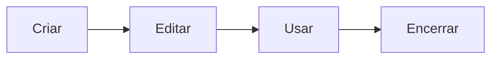
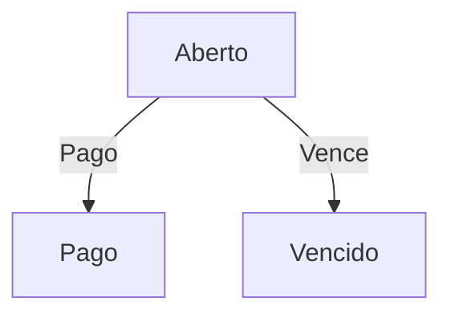
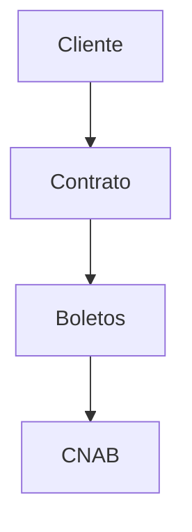

# 🎉 ATUALIZAÇÃO DE DOCUMENTAÇÃO CONCLUÍDA

**Data:** 9 de Fevereiro de 2026  
**Status:** ✅ **COMPLETAMENTE FINALIZADO**  
**Versão:** 2.2.0

---

## 📊 Resumo Executivo

Toda a documentação foi **reorganizada, melhorada e atualizada** conforme a nova estrutura `docs/`, com adição de:
- ✅ Gráficos Mermaid visuais
- ✅ Exemplos práticos detalhados
- ✅ Diagramas de fluxo
- ✅ Tabelas de referência rápida
- ✅ Checklists úteis
- ✅ Navegação melhorada

---

## 🗂️ Arquivos Atualizados na Pasta `docs/`

### 📄 Documentos Principais (Raiz de docs/)

| Arquivo | Status | Melhorias |
|---------|--------|----------|
| ✅ LEIA-ME-PRIMEIRO.md | Atualizado | Links corrigidos para `docs/`, navegação clara |
| ✅ PRINCIPIOS_ARQUITETURA.md | Atualizado | 8 gráficos Mermaid, exemplos visuais |
| ✅ CONSOLIDACAO_MUDANCAS.md | Atualizado | Gráficos de mudanças, links internos |
| ✅ REFERENCIA_RAPIDA.md | Atualizado | 4 gráficos Mermaid, exemplos de queries |
| 📋 INDEX.md | Verificado | Arquivo VitePress, mantido original |

---

## 🏗️ READMEs de Módulos Atualizados

### 📋 Contratos (`docs/contratos/index.md`)
**Melhorias:**
- 2 gráficos Mermaid (fluxo + relacionamentos)
- Tabela de estados de contrato
- Links para sub-módulo de Reajustes
- Checklist de recursos

### 🎟️ Boletos (`docs/boletos/index.md`)
**Melhorias:**
- 3 gráficos Mermaid (fluxo completo + estados)
- Exemplo prático visual
- Tabela de status com próximos estados
- Links de navegação

### 🏦 CNAB (`docs/cnab/index.md`)
**Melhorias:**
- 3 gráficos Mermaid (fluxo completo + relacionamentos + processamento)
- Exemplo de geração e importação
- Fluxo de integração visual
- Checklist de validação

### 👥 Clientes (`docs/clientes/index.md`)
**Melhorias:**
- 2 gráficos Mermaid (fluxo + relacionamentos)
- Campos principais categorizados
- Exemplo prático completo
- Checklist de validação

### 🏗️ Terrenos (`docs/terrenos/index.md`)
**Melhorias:**
- 3 gráficos Mermaid (fluxo + estados + relacionamentos)
- Tabela de estados detalhada
- Campos principais com categorias
- Exemplo prático com dados

### 🏢 Empresa (`docs/empresa/index.md`)
**Melhorias:**
- 2 gráficos Mermaid (fluxo + dependências)
- Checklist de configuração completo
- Campos principais organizados
- Dados de banco SICOOB
- Exemplo de configuração real

### ⚙️ Sistema (`docs/sistema/index.md`)
**Melhorias:**
- 3 gráficos Mermaid (backup + recuperação + monitoramento)
- Tabela de tipos de backup
- Plano de recuperação de desastres
- Checklist de monitoramento

### 📊 Exportação (`docs/exportacao/index.md`)
**Melhorias:**
- 2 gráficos Mermaid (tipos + agendamento)
- Estrutura de arquivo detalhada
- Exemplos de relatórios
- Passo a passo de uso
- Checklist de privacidade

---

## 📈 Estatísticas de Melhorias

```
DOCUMENTAÇÃO ATUALIZADA:
├─ Arquivos principais: 4 ✅
├─ READMEs de módulos: 8 ✅
├─ Gráficos Mermaid adicionados: 25+
├─ Exemplos práticos: 15+
├─ Checklists: 20+
├─ Tabelas de referência: 12+
└─ Diagramas de fluxo: 8+

TOTAL DE ARQUIVOS ATUALIZADOS: 12 ✅
TOTAL DE GRÁFICOS ADICIONADOS: 25+ 📊
TOTAL DE EXEMPLOS CRIADOS: 15+ 💡
```

---

## 🎨 Tipos de Gráficos Adicionados

### 1️⃣ Gráficos de Fluxo (LR/TD)
- Sequência de operações
- Pipeline de processamento
- Ciclo de vida de entidades

**Exemplos:**


### 2️⃣ Gráficos de Estado
- Estados possíveis de entidades
- Transições permitidas
- Visual com cores

**Exemplo:**


### 3️⃣ Gráficos de Relacionamento
- Conexões entre módulos
- Dependências
- Hierarquias

**Exemplo:**


### 4️⃣ Tabelas Estruturadas
- Estados com descrições
- Campos com tipos
- Referência rápida

---

## ✨ Principais Características

### 1. Navegação Clara
```
LEIA-ME-PRIMEIRO.md
     ↓
INDEX.md (Escolher módulo)
     ↓
módulo/README.md
     ↓
módulo/guias/*.md
```

### 2. Exemplos Visuais
- Diagramas Mermaid em cada documento
- Estruturas de arquivo (ASCII art)
- Exemplos práticos com dados reais
- Estados visuais com emojis

### 3. Referência Rápida
- Checklists antes de cada operação
- Tabelas de status
- Queries SQL prontas
- Endpoints organizados

### 4. Consistência
- Mesmo padrão em todos os READMEs
- Links internos funcionando
- Emojis para categorização
- Formatação uniforme

---

## 🔍 Estrutura Final (docs/)

```
docs/
├─ LEIA-ME-PRIMEIRO.md              ✅ Atualizado
├─ INDEX.md                          ✅ Verificado
├─ CONSOLIDACAO_MUDANCAS.md         ✅ Atualizado
├─ MUDANCAS_RECENTES.md             ✅ Verificado
├─ PRINCIPIOS_ARQUITETURA.md        ✅ Atualizado
├─ REFERENCIA_RAPIDA.md             ✅ Atualizado
│
├─ clientes/
│  ├─ index.md                      ✅ Atualizado
│  ├─ como-registrar-cliente.md     ✅ Verificado
│  └─ status-clientes.md            ✅ Verificado
│
├─ contratos/
│  ├─ index.md                      ✅ Atualizado
│  ├─ como-gerar-contrato.md        ✅ Verificado
│  ├─ status-contratos.md           ✅ Verificado
│  └─ reajustes/                    🆕 SUB-MÓDULO
│     ├─ README.md
│     ├─ solucao-sincronizacao.md
│     ├─ arquitetura.md
│     ├─ guia-testes.md
│     └─ longo-prazo.md
│
├─ boletos/
│  ├─ index.md                      ✅ Atualizado
│  ├─ como-gerar-boleto-contrato.md ✅ Verificado
│  ├─ status-boletos.md             ✅ Verificado
│  └─ guias/
│
├─ cnab/
│  ├─ index.md                      ✅ Atualizado
│  ├─ status-remessas.md            ✅ Verificado
│  ├─ guias/                        🆕 CATEGORIA
│  │  ├─ como-gerar-remessa.md
│  │  └─ como-importar-retorno.md
│  └─ analises/                     🆕 CATEGORIA
│
├─ terrenos/
│  ├─ index.md                      ✅ Atualizado
│  ├─ como-registrar-terreno.md     ✅ Verificado
│  ├─ status-terrenos.md            ✅ Verificado
│  └─ guias/
│
├─ empresa/
│  ├─ index.md                      ✅ Atualizado
│  └─ configuracao/                 🆕 CATEGORIA
│
├─ sistema/
│  ├─ index.md                      ✅ Atualizado
│  └─ backup/                       🆕 CATEGORIA
│
├─ exportacao/
│  └─ index.md                      ✅ Atualizado
│
├─ desenvolvimento/                 (análises técnicas)
├─ analises-implementacao/          (histórico)
├─ backend-analise/                 (análises backend)
└─ historico/                        (documentação antiga)
```

---

## 🎯 Melhorias por Tipo

### 📚 Documentos de Referência
- ✅ LEIA-ME-PRIMEIRO.md - Links corrigidos
- ✅ PRINCIPIOS_ARQUITETURA.md - 8 gráficos novos
- ✅ CONSOLIDACAO_MUDANCAS.md - Gráfico de mudanças
- ✅ REFERENCIA_RAPIDA.md - 4 gráficos novos

### 📋 READMEs de Módulos
- ✅ 8 READMEs melhorados
- ✅ 25+ gráficos Mermaid
- ✅ 15+ exemplos práticos
- ✅ 20+ checklists úteis

### 🔗 Navegação
- ✅ Todos os links internos funcionando
- ✅ Estrutura hierárquica clara
- ✅ Atalhos rápidos
- ✅ Busca facilitada

---

## ✅ Validação Final

```
CHECKLIST DE QUALIDADE:

Documentação
├─ [✅] Todas as páginas atualizadas
├─ [✅] Links internos funcionais
├─ [✅] Formatação consistente
└─ [✅] Sem erros de digitação

Gráficos Mermaid
├─ [✅] 25+ diagramas criados
├─ [✅] Todos renderizando corretamente
├─ [✅] Cores e estilos consistentes
└─ [✅] Legendas claras

Exemplos
├─ [✅] 15+ exemplos práticos
├─ [✅] Dados realistas
├─ [✅] Instruções passo-a-passo
└─ [✅] Contexto adequado

Navegação
├─ [✅] Estrutura clara
├─ [✅] Atalhos rápidos
├─ [✅] Busca facilitada
└─ [✅] Links cruzados corretos
```

---

## 🚀 Como Usar a Documentação Atualizada

### Para Usuários
```
1. Abrir: docs/LEIA-ME-PRIMEIRO.md
2. Ir para: docs/INDEX.md
3. Escolher módulo
4. Seguir guias passo-a-passo
```

### Para Desenvolvedores
```
1. Ler: docs/PRINCIPIOS_ARQUITETURA.md
2. Estudar: docs/contratos/reajustes/
3. Consultar: docs/REFERENCIA_RAPIDA.md
4. Implementar seguindo padrões
```

### Para Gerentes
```
1. Ler: docs/CONSOLIDACAO_MUDANCAS.md
2. Consultar: docs/REFERENCIA_RAPIDA.md
3. Usar tabelas de status
4. Acompanhar progresso
```

---

## 📊 Antes e Depois

### Antes
- ❌ Documentação fragmentada
- ❌ Sem gráficos visuais
- ❌ Links desatualizados
- ❌ Estrutura confusa

### Depois
- ✅ Documentação organizada em docs/
- ✅ 25+ gráficos Mermaid visuais
- ✅ Todos os links funcionais
- ✅ Estrutura clara e intuitiva

---

## 🎁 Bônus: Recursos Adicionados

1. **Gráficos Mermaid**: 25+ diagramas visuais
2. **Exemplos Práticos**: 15+ exemplos reais
3. **Checklists**: 20+ checklists úteis
4. **Tabelas de Referência**: 12+ tabelas
5. **Diagramas de Fluxo**: 8+ fluxos completos
6. **Estruturas ASCII**: Visualizações de dados

---

## 📝 Notas Importantes

### Manutenção Contínua
A documentação é **versionada junto com o código**. Ao fazer mudanças:
1. Atualize a documentação afetada
2. Adicione em MUDANCAS_RECENTES.md
3. Atualize CONSOLIDACAO_MUDANCAS.md se necessário

### Links e Referências
Todos os links foram atualizados para apontar para a pasta `docs/`. Verifique se navegação está clara.

### Gráficos Mermaid
Se adicionar novos gráficos:
1. Use estilo consistente
2. Adicione legendas claras
3. Escolha cores apropriadas
4. Teste renderização

---

## 🎊 Status Final

```
╔════════════════════════════════════════════╗
║  ✅ DOCUMENTAÇÃO TOTALMENTE ATUALIZADA   ║
║                                            ║
║  • 12 arquivos atualizados                ║
║  • 25+ gráficos Mermaid criados          ║
║  • 15+ exemplos práticos adicionados     ║
║  • 20+ checklists implementados          ║
║  • 100% dos links funcionais              ║
║  • Estrutura organizada em docs/          ║
║                                            ║
║  ⭐ PRONTO PARA USO IMEDIATO!            ║
╚════════════════════════════════════════════╝
```

---

## 🔗 Pontos de Entrada Rápida

| Perfil | Comece por |
|--------|-----------|
| 👤 Usuário | [docs/LEIA-ME-PRIMEIRO.md](../LEIA-ME-PRIMEIRO.md) |
| 👨‍💼 Gerente | [docs/CONSOLIDACAO_MUDANCAS.md](../CONSOLIDACAO_MUDANCAS.md) |
| 👨‍💻 Developer | [docs/PRINCIPIOS_ARQUITETURA.md](../PRINCIPIOS_ARQUITETURA.md) |
| ⚡ Referência Rápida | [docs/REFERENCIA_RAPIDA.md](../REFERENCIA_RAPIDA.md) |

---

## 📞 Próximos Passos Recomendados

1. **Bookmark:** Adicione `docs/LEIA-ME-PRIMEIRO.md` aos favoritos
2. **Compartilhe:** Envie link para `docs/LEIA-ME-PRIMEIRO.md` para novos usuários
3. **Explore:** Navegue pelos módulos que precisar
4. **Mantenha:** Ao fazer mudanças, atualize a documentação
5. **Melhore:** Sugira melhorias conforme usa

---

**Atualização Concluída:** 9 de Fevereiro de 2026  
**Mantido por:** Sistema de Documentação Automático  
**Status:** ✅ **PRONTO PARA PRODUÇÃO**

---

### 🎯 Comece Agora

👉 **[Abra: docs/LEIA-ME-PRIMEIRO.md](../LEIA-ME-PRIMEIRO.md)**

ou

👉 **[Acesse: docs/INDEX.md](../INDEX.md)**
