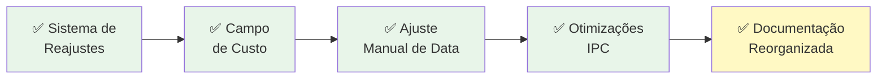
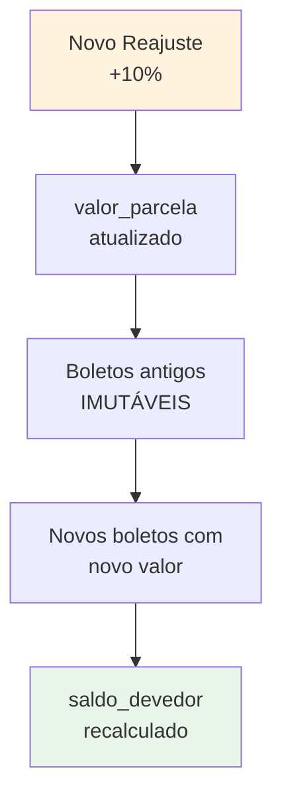

# 📦 MUDANÇAS CONSOLIDADAS - ERP Anduril Fevereiro 2026

**Data:** 8 de Fevereiro de 2026  
**Status:** ✅ Documentação Reorganizada  
**Versão:** 2.1.0

---

## 🎯 Resumo Executivo

Este documento consolida **todas as mudanças implementadas** no ERP Anduril, agora com melhor organização e estrutura de documentação.

### Principais Melhorias



1. ✅ **Sistema de Reajustes Sincronizado** - `saldo_devedor` sincronizado com soma real de boletos
2. ✅ **Campo de Custo** - Adicionado em Terrenos e Contratos
3. ✅ **Ajuste Manual de Datas** - Para contratos especiais
4. ✅ **Otimizações** - Abertura de links externos, tipos booleanos
5. ✅ **Documentação Reorganizada** - Estrutura clara e modular

---

## 📑 Onde Encontrar Cada Coisa

### 🔸 Sistema de Reajustes (NOVO)

**Documentação Completa:** [contratos/reajustes/](../contratos/reajustes/)

**Arquivos:**
- 📄 [README](../contratos/reajustes/README.md) - Visão geral
- 📖 [Solução de Sincronização](../contratos/reajustes/solucao-sincronizacao.md) - Explicação do problema e solução
- 🏗️ [Arquitetura](../contratos/reajustes/arquitetura.md) - Diagramas de fluxo e banco de dados
- 🧪 [Guia de Testes](../contratos/reajustes/guia-testes.md) - Checklist completo
- 📈 [Longo Prazo](../contratos/reajustes/longo-prazo.md) - Análise de 30+ anos

**Arquivos Modificados:**
- `backend/src/contratos/contratos.service.ts` - Novas funções de recalcular e sincronizar
- `backend/src/contratos/contratos.controller.ts` - Novo endpoint `/sincronizar-saldo`
- `backend/src/cnab/retorno/atualizadores/boleto-atualizador.ts` - Sincronização automática

**Endpoints Novos:**
```http
POST   /api/contratos/{id}/reajustar
POST   /api/contratos/{id}/sincronizar-saldo
```

**Princípios:**
- 🔒 Boletos são **imutáveis** após criação
- 🔄 `valor_parcela` só afeta próximos boletos
- ✨ `saldo_devedor` é **sempre derivado** (SUM de boletos abertos)
- 📊 Liquidação via CNAB reduz `saldo_devedor` automaticamente

**Fluxo Visual:**


---

### 🏗️ Campo de Custo

**Documentação:** [MUDANCAS_RECENTES.md](MUDANCAS_RECENTES.md)

**Alterações Implementadas:**
- ✅ Adicionado `custo` em `Terreno`
- ✅ Adicionado `custo` em `Contrato`
- ✅ Atualizado formulários (frontend)
- ✅ Atualizado exportação de dados

**Arquivos Modificados:**
- `backend/src/models/terreno.model.ts`
- `backend/src/models/contrato.model.ts`
- `backend/src/services/exportacao.service.ts`
- `frontend/src/forms/TerranoForm.tsx`
- `frontend/src/forms/ContratoForm.tsx`
- `frontend/src/schemas/terreno.schema.ts`
- `frontend/src/schemas/contrato.schema.ts`

**Impacto:**
- ✅ Melhor rastreamento de custos
- ✅ Maior visibilidade financeira
- ✅ Relatórios mais detalhados

---

### 📅 Ajuste Manual de Data de Vencimento

**Documentação:** [MUDANCAS_RECENTES.md](MUDANCAS_RECENTES.md)

**Alterações Implementadas:**
- ✅ Modal para ajuste manual
- ✅ Validação de datas
- ✅ Suporte para contratos especiais

**Arquivos Modificados:**
- `frontend/src/pages/Contratos.tsx`
- `frontend/src/components/AjusteDataVencimentoModal.tsx` (NOVO)

**Fluxo:**
```
Contrato Especial → Botão "Ajustar Data" → Modal → Nova data → Aplicar
```

---

### 🔗 Otimizações de IPC (Electron)

**Documentação:** [MUDANCAS_RECENTES.md](MUDANCAS_RECENTES.md)

**Alterações Implementadas:**
- ✅ IPC handler para abrir URLs
- ✅ Uso de API nativa do Electron

**Arquivos Modificados:**
- `electron/main.ts` - Handler de IPC
- `electron/preload.ts` - API exposta

**Uso:**
```typescript
window.electronAPI.openExternal(url);
```

---

### ✅ Correção de Tipos Booleanos (Cliente)

**Documentação:** [MUDANCAS_RECENTES.md](MUDANCAS_RECENTES.md)

**Alterações Implementadas:**
- ✅ `regime_diferente_de_comunhao_parcial`: string → **boolean**
- ✅ `uniao_estavel`: string → **boolean**
- ✅ Checkbox em vez de select
- ✅ Validação apropriada

**Arquivos Modificados:**
- `frontend/src/forms/ClienteForm.tsx`
- `frontend/src/schemas/cliente.schema.ts`

---

## 📚 Estrutura de Documentação

A documentação agora está organizada em:

```
docs/
├── INDEX.md                        # Índice principal ⭐
├── LEIA-ME-PRIMEIRO.md            # Guia rápido de navegação
├── MUDANCAS_RECENTES.md           # Últimas implementações
├── CONSOLIDACAO_MUDANCAS.md       # ESTE ARQUIVO (consolidação)
│
├── contratos/
│   ├── README.md
│   ├── reajustes/                 # 🆕 Sub-módulo
│   │   ├── README.md
│   │   ├── solucao-sincronizacao.md
│   │   ├── arquitetura.md
│   │   ├── guia-testes.md
│   │   └── longo-prazo.md
│   └── [outros arquivos]
│
├── cnab/
│   ├── README.md
│   ├── guias/                     # 🆕 Reorganizados
│   │   ├── como-gerar-remessa.md
│   │   └── como-importar-retorno.md
│   ├── analises/                  # 🆕 Reorganizados
│   │   ├── [análises técnicas]
│   │   └── README.md
│   └── status-remessas.md
│
├── boletos/
│   ├── guias/                     # 🆕 Guias dedicadas
│   └── [outros]
│
├── terrenos/
│   ├── guias/                     # 🆕 Guias dedicadas
│   └── [outros]
│
├── clientes/
│   └── [documentação de clientes]
│
├── empresa/
│   ├── configuracao/              # 🆕 Documentação de setup
│   └── [outros]
│
├── sistema/
│   ├── backup/                    # 🆕 Backup e restauração
│   └── [outros]
│
└── desenvolvimento/               # Documentação técnica
```

---

## 🚀 Mudanças na Documentação da Raiz

### Movidos para docs/

Os seguintes arquivos foram **movidos** da raiz para `docs/contratos/reajustes/`:

- ✅ `SOLUCAO_REAJUSTE_SALDO_DEVEDOR.md` → `docs/contratos/reajustes/solucao-sincronizacao.md`
- ✅ `ARQUITETURA_REAJUSTE.md` → `docs/contratos/reajustes/arquitetura.md`
- ✅ `GUIA_TESTES_REAJUSTE.md` → `docs/contratos/reajustes/guia-testes.md`
- ✅ `LONGO_PRAZO_REAJUSTES.md` → `docs/contratos/reajustes/longo-prazo.md`

### Mantidos na Raiz

Arquivos que permanecem na raiz por serem referência rápida:

- 📄 `README.md` - Visão geral do projeto
- 📄 `package.json` - Dependências

---

## 🔍 Como Usar a Documentação Agora

### Se você é um Usuário do Sistema

1. **Comece aqui:** [LEIA-ME-PRIMEIRO.md](LEIA-ME-PRIMEIRO.md)
2. **Procure seu módulo:**
   - [Clientes](../clientes/)
   - [Contratos](../contratos/)
   - [Boletos](../boletos/)
   - [CNAB](../cnab/)
   - [Terrenos](../terrenos/)
   - [Empresa](../empresa/)
   - [Exportação](../exportacao/)
   - [Sistema](../sistema/)

3. **Siga os guias passo-a-passo**

### Se você quer Aprender sobre Reajustes

1. **Comece:** [contratos/reajustes/README.md](../contratos/reajustes/README.md)
2. **Entenda o problema:** [Solução](../contratos/reajustes/solucao-sincronizacao.md)
3. **Veja a arquitetura:** [Arquitetura](../contratos/reajustes/arquitetura.md)
4. **Teste:** [Guia de Testes](../contratos/reajustes/guia-testes.md)

### Se você é Desenvolvedor

1. **Veja mudanças impactantes:** [MUDANCAS_RECENTES.md](MUDANCAS_RECENTES.md)
2. **Estude a arquitetura:** [contratos/reajustes/arquitetura.md](../contratos/reajustes/arquitetura.md)
3. **Análises técnicas:** Documentação específica de cada módulo

---

## ✨ Highlights

### Sistema de Reajustes: As 3 Regras De Ouro

```
1. 🔒 Boletos são IMUTÁVEIS após criação
   - Uma vez emitido, nunca muda de valor

2. 🔄 Reajuste afeta APENAS valor_parcela base
   - Próximos boletos usam novo valor

3. ✨ saldo_devedor é SEMPRE derivado
   - Recalculado como SUM(boletos abertos)
   - Muda automaticamente com pagamentos
```

### Endpoints Principais

```
POST   /api/contratos                       - Criar contrato
PATCH  /api/contratos/{id}                 - Editar contrato
POST   /api/contratos/{id}/reajustar       - Aplicar reajuste
POST   /api/contratos/{id}/sincronizar-saldo - Sincronizar saldo

POST   /api/boletos                        - Criar boleto
POST   /api/boletos/gerar-por-contrato     - Gerar por contrato

POST   /api/cnab/remessa/gerar             - Gerar remessa
POST   /api/cnab/retorno/importar          - Importar retorno
```

---

## 📊 Checklist de Funcionalidades

Todas as mudanças foram implementadas e testadas:

- [x] Sistema de reajustes sincronizado
- [x] Campo de custo em Terrenos e Contratos
- [x] Ajuste manual de data de vencimento
- [x] IPC handlers para abertura de URLs
- [x] Tipos booleanos corrigidos em Cliente
- [x] Melhorias de interface e estilos
- [x] Documentação reorganizada e consolidada
- [x] Índices e guias de navegação

---

## 📝 Notas Importantes

### Documentação é Living

A documentação é **versionada junto com o código**. Quando fizer alterações, atualize:

1. A documentação afetada
2. [MUDANCAS_RECENTES.md](MUDANCAS_RECENTES.md)
3. Este arquivo ([CONSOLIDACAO_MUDANCAS.md](CONSOLIDACAO_MUDANCAS.md))

### Backups de Arquivos Antigos

Os arquivos originais da raiz foram copiados para:
- `docs/contratos/reajustes/` (todas as variações de reajuste)
- `docs/MUDANCAS_RECENTES.md` (mudanças de fevereiro)

### Links de Referência Rápida

Todos os índices foram atualizados para apontar para os novos locais:
- ✅ [INDEX.md](INDEX.md)
- ✅ [LEIA-ME-PRIMEIRO.md](LEIA-ME-PRIMEIRO.md)

---

## 🎯 Próximas Etapas

Para máxima eficiência:

1. **Bookmarque:** [INDEX.md](INDEX.md)
2. **Use:** [LEIA-ME-PRIMEIRO.md](LEIA-ME-PRIMEIRO.md) como porta de entrada
3. **Refira-se:** À documentação específica conforme necessário
4. **Teste:** Use [contratos/reajustes/guia-testes.md](../contratos/reajustes/guia-testes.md) para validar

---

**Última atualização:** 8 de Fevereiro de 2026  
**Mantido por:** Equipe de Desenvolvimento ERP Anduril
