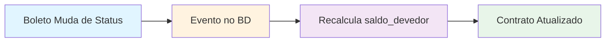
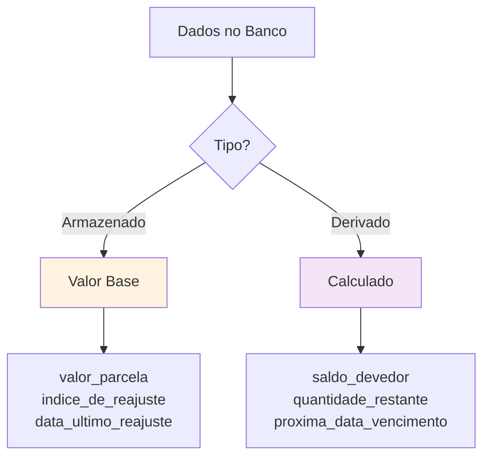
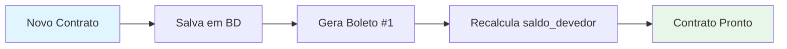
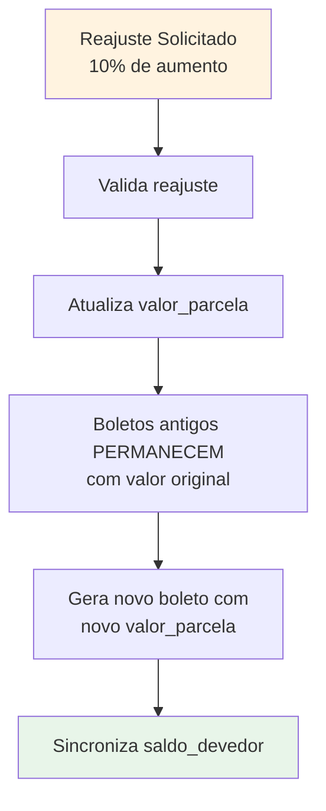
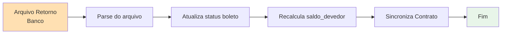
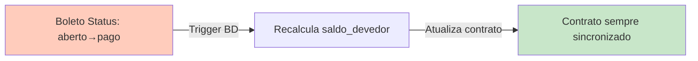
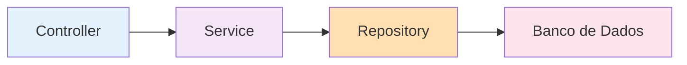

# 🏗️ Princípios de Arquitetura - ERP Anduril

**Status:** Documentação de Arquitetura  
**Última atualização:** 8 de Fevereiro de 2026

---

## 🎯 Princípios Fundamentais

### 1. **Sincronização Automática**

O sistema sempre mantém dados sincronizados automaticamente:



**Implementação:**
- Eventos no banco de dados atualizam derivados
- Transações atômicas garantem consistência
- Validações em tempo real
- Sem operações manuais necessárias

---

### 2. **Imutabilidade de Transações**

Uma vez que uma transação é registrada (como um boleto), ela NUNCA muda:

```
Boleto criado em 01/01/2026 por R$ 3.333,33
    ↓ (NUNCA MUDA, MESMO COM REAJUSTE)
Mesmo que reajuste em 02/02/2026
    ↓
Boleto CONTINUA R$ 3.333,33
```

**Benefícios:**
- ✅ Auditoria clara
- ✅ Histórico confiável
- ✅ Cálculos determinísticos
- ✅ Rastreabilidade completa

**Exemplo visual:**
```
Contrato: CONT-001
├─ Boleto #1 (Jan/2026): R$ 3.333,33 ← IMUTÁVEL
├─ Boleto #2 (Fev/2026): R$ 3.333,33 ← IMUTÁVEL
├─ Boleto #3 (Mar/2026): R$ 3.333,33 ← IMUTÁVEL
│
└─ [REAJUSTE APLICADO: +10%]
   ├─ Boleto #4 (Abr/2026): R$ 3.666,66 ← Nova parcela
   ├─ Boleto #5 (Mai/2026): R$ 3.666,66 ← Nova parcela
   └─ Boleto #6 (Jun/2026): R$ 3.666,66 ← Nova parcela
```

---

### 3. **Dados Derivados vs Armazenados**

Distingue entre dados que são **calculados** vs dados que são **armazenados**:



**Dados Armazenados (no BD):**
- `valor_parcela` - Valor base do contrato/boleto
- `indice_de_reajuste` - % de reajuste anual
- `data_ultimo_reajuste` - Quando foi reajustado
- `data_vencimento` - Data prevista de pagamento

**Dados Derivados (calculados):**
- `saldo_devedor` = SUM(boletos onde status = 'aberto')
- `quantidade_restante` = COUNT(boletos onde status = 'aberto')
- `dias_em_atraso` = TODAY() - data_vencimento
- `valor_total` = valor_parcela × quantidade_parcelas

---

## 🔄 Fluxos Principais

### Fluxo: Criar Contrato



**Dados de entrada:**
- `numero_contrato` (único)
- `valor_parcela`
- `quantidade_parcelas`
- `data_primeira_parcela`
- `cliente_id`

---

### Fluxo: Reajustar Contrato



**O que muda:**
- `valor_parcela` aumenta
- `data_ultimo_reajuste` atualizada
- Novos boletos usam novo valor
- Boletos existentes não mudam

**O que NÃO muda:**
- Boletos já emitidos
- Boletos já pagos
- Histórico de transações

---

### Fluxo: Importar Retorno CNAB



**Dados atualizados:**
- `status` do boleto (ligado → pago)
- `data_pagamento`
- `valor_pago`
- `saldo_devedor` recalculado automaticamente

---

## 📊 Estrutura de Dados

### Tabela: Contratos

```
contrato
├─ id (PK)
├─ numero_contrato (UNIQUE)
├─ valor_parcela (DECIMAL) ← MUDA com reajuste
├─ indice_de_reajuste (DECIMAL) ← % anual
├─ data_ultimo_reajuste (DATE)
├─ quantidade_parcelas (INT) ← Original
├─ saldo_devedor (DECIMAL) ← DERIVADO
├─ cliente_id (FK)
└─ timestamps
```

### Tabela: Boletos

```
boleto
├─ id (PK)
├─ contrato_id (FK)
├─ valor_parcela (DECIMAL) ← IMUTÁVEL
├─ status (ENUM: aberto/pago/vencido)
├─ data_vencimento (DATE)
├─ data_pagamento (DATE ou NULL)
├─ valor_pago (DECIMAL)
└─ timestamps
```

---

## ✨ Características Principais

### Sincronização Automática

Toda mudança no boleto (via CNAB ou manual) atualiza a contagem de saldo:



### Validações em Cascata

Cada operação passa por validações:

1. **Validação de Entrada** - Dados corretos?
2. **Validação de Negócio** - Regras atendidas?
3. **Validação de Estado** - Sistema pode fazer isso agora?
4. **Validação Transacional** - Todas as mudanças consistentes?

---

## 🔒 Segurança de Dados

### Princípios de Segurança

- ✅ Transações atômicas (tudo ou nada)
- ✅ Sem deleção de histórico (soft delete)
- ✅ Auditoria completa de mudanças
- ✅ Validação dupla (BD + API)
- ✅ Isolamento de dados por tenant

### Exemplo: Segurança em Reajuste

```
1. API recebe pedido de reajuste
2. Valida se contrato existe
3. Calcula novo valor_parcela
4. Abre transação no BD
5. Atualiza valor_parcela
6. Atualiza data_ultimo_reajuste
7. Gera novo boleto (com novo valor)
8. Recalcula saldo_devedor
9. Confirma transação
10. Se erro em qualquer passo → tudo reverte
```

---

## 📈 Padrão de Design

### Repository Pattern

Acesso a dados centralizado:



### Service Pattern

Lógica de negócio isolada:

```
ContratoService
├─ criar(dados)
├─ reajustar(id, percentual)
├─ sincronizarSaldo(id)
├─ listar()
└─ obter(id)
```

---

## 🎯 Resumo dos Princípios

| Princípio | Benefício |
|-----------|----------|
| Sincronização Automática | Sempre consistente |
| Imutabilidade de Transações | Auditoria clara |
| Dados Derivados | Sem cálculos incorretos |
| Transações Atômicas | Tudo ou nada |
| Validação em Cascata | Máxima segurança |

---

*Última atualização: 8 de Fevereiro de 2026*
