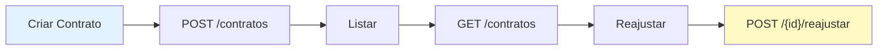
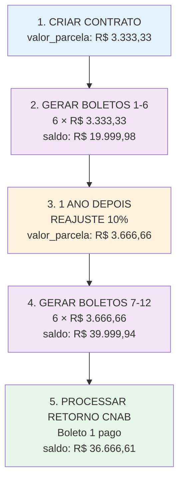

# ⚡ Referência Rápida - ERP Anduril

**Uma página com tudo o que você precisa saber imediatamente**

---

## 🚀 Endpoints Principais

### Contratos

```http
POST   /api/contratos                          → Criar novo contrato
GET    /api/contratos                          → Listar todos
GET    /api/contratos/{id}                     → Obter detalhes
PATCH  /api/contratos/{id}                     → Editar contrato
DELETE /api/contratos/{id}                     → Deletar contrato

POST   /api/contratos/{id}/reajustar          → Aplicar reajuste anual
POST   /api/contratos/{id}/sincronizar-saldo  → Sincronizar saldo_devedor
```

**Fluxo típico:**


---

### Boletos

```http
POST   /api/boletos                            → Criar boleto individual
POST   /api/boletos/gerar-por-contrato        → Gerar boletos em lote
GET    /api/boletos/{id}                       → Obter detalhes
PATCH  /api/boletos/{id}                       → Editar boleto
```

---

### CNAB

```http
POST   /api/cnab/remessa/gerar                → Gerar remessa CNAB
POST   /api/cnab/remessa/download/{id}        → Baixar remessa gerada
POST   /api/cnab/retorno/importar             → Importar retorno do banco
GET    /api/cnab/remessas                      → Listar remessas
GET    /api/cnab/retornos                      → Listar retornos
```

---

### Outros

```http
GET    /api/clientes/{id}                      → Obter dados de cliente
GET    /api/empresa                            → Obter dados da empresa
POST   /api/empresa                            → Configurar dados da empresa
```

---

## 📋 Modelos Principais

### Contrato

```json
{
  "id": 1,
  "numero_contrato": "CONT-001",
  "valor_parcela": 3333.33,
  "saldo_devedor": 19999.98,
  "quantidade_parcelas": 6,
  "indice_de_reajuste": 10,
  "data_do_ultimo_reajuste": "2025-01-01",
  "custo": 5000.00,
  "cliente_id": 1,
  "created_at": "2026-01-01"
}
```

### Boleto

```json
{
  "id": 1,
  "contrato_id": 1,
  "valor_parcela": 3333.33,
  "status": "aberto",
  "data_vencimento": "2026-02-15",
  "data_pagamento": null,
  "valor_pago": null
}
```

---

## 🔑 Conceitos-Chave em 60 Segundos

### `valor_parcela` (no Contrato)

- Valor base para **próximos boletos**
- Muda quando reajuste é aplicado
- Cada boleto congela seu valor

### `saldo_devedor`

- **SUM** de todos boletos com status `'aberto'`
- Sincronizado automaticamente
- Nunca alterar manualmente

### Boletos

- 🔒 **Imutáveis** após criação
- Uma vez R$ 3.333,33, sempre R$ 3.333,33
- Reajuste não afeta boletos já emitidos

### `custo`

- Rastreamento de custos adicionais
- Suportado em Contratos e Terrenos
- Útil para análise de margens

---

## 🔄 Fluxo Padrão: Contrato Completo



---

## 🧪 Queries Úteis

### Ver contrato + saldo sincronizado?

```sql
SELECT 
  c.numero_contrato,
  c.saldo_devedor,
  SUM(b.valor_parcela) as boletos_abertos,
  (c.saldo_devedor - SUM(b.valor_parcela)) as diferenca
FROM contratos c
LEFT JOIN boletos b ON c.id = b.contrato_id AND b.status='aberto'
WHERE c.id = ?
GROUP BY c.id;
```

### Listar contratos com desincronização

```sql
SELECT 
  c.numero_contrato,
  c.saldo_devedor,
  SUM(b.valor_parcela) as real
FROM contratos c
LEFT JOIN boletos b ON c.id = b.contrato_id AND b.status='aberto'
GROUP BY c.id
HAVING ABS(c.saldo_devedor - SUM(b.valor_parcela)) > 0.01;
```

### Ver histórico de reajustes

```sql
SELECT 
  numero_contrato,
  indice_de_reajuste,
  data_do_ultimo_reajuste,
  valor_parcela
FROM contratos
WHERE indice_de_reajuste IS NOT NULL
ORDER BY data_do_ultimo_reajuste DESC;
```

### Totais por status de boleto

```sql
SELECT 
  status,
  COUNT(*) as quantidade,
  SUM(valor_parcela) as total
FROM boletos
WHERE contrato_id = ?
GROUP BY status;
```

---

## 🆘 Problemas Comuns

| Problema | Solução |
|----------|---------|
| saldo_devedor errado | `POST /contratos/{id}/sincronizar-saldo` |
| Boleto com valor errado | Verificar `status='aberto'` e `contrato_id` |
| Reajuste não funcionando | Validar 1 ano desde último reajuste |
| CNAB não importa | Verificar formato do arquivo (layout SICOOB) |
| Boletos não aparecem | Gerar com `POST /boletos/gerar-por-contrato` |

---

## 🎯 Checklist: Gerar Remessa Correta

- [ ] Contrato existe e está ativo
- [ ] `saldo_devedor` está sincronizado (use query acima)
- [ ] Boletos têm status `'aberto'`
- [ ] Datas de vencimento são futuras (5+ dias)
- [ ] Dados da empresa estão preenchidos (CNPJ, etc)
- [ ] Banco SICOOB configurado (números e agência)
- [ ] Arquivo não foigerado recentemente
- [ ] Gerar remessa via API
- [ ] Verificar valores no arquivo gerado
- [ ] Enviar para o banco

---

## 💰 Cálculos Rápidos

### Saldo Devedor

```
saldo_devedor = COUNT(boletos abertos) × valor_parcela
              = 6 × 3.333,33
              = 19.999,98
```

### Após Reajuste (+10%)

```
novo_valor_parcela = valor_parcela × (1 + indice/100)
                   = 3.333,33 × 1.10
                   = 3.666,66
```

### Após Liquidação de 1 Boleto

```
novo_saldo = COUNT(boletos não-pagos) × valor_parcela
           = (6-1) × 3.333,33
           = 16.666,65
```

### Com Múltiplos Reajustes

```
Parcela 1-6:  6 × 3.333,33 = 19.999,98
Parcela 7-12: 6 × 3.666,66 = 21.999,96
Total:                        41.999,94
```

---

## 📚 Documentação Completa

Para aprender mais, consulte:

- 📖 [INDEX.md](INDEX.md) - Índice completo
- 🏗️ [PRINCIPIOS_ARQUITETURA.md](PRINCIPIOS_ARQUITETURA.md) - Conceitos
- 📈 [contratos/reajustes/](../contratos/reajustes/) - Reajustes detalhado
- 🔗 [cnab/](../cnab/) - CNAB completo
- 🚀 [MUDANCAS_RECENTES.md](MUDANCAS_RECENTES.md) - O que é novo
- 📖 [LEIA-ME-PRIMEIRO.md](LEIA-ME-PRIMEIRO.md) - Guia de navegação

---

## ⏱️ Tempos Típicos de Operação

| Operação | Tempo | Nota |
|----------|-------|------|
| Criar contrato | <100ms | Síncrono |
| Gerar 12 boletos | 200-500ms | Em lote |
| Reajuste | 100-300ms | Recalcula saldo |
| Sincronizar saldo | 50-100ms | Query rapida |
| Gerar remessa CNAB | 1-3s | I/O de arquivo |
| Importar retorno CNAB | 2-5s | Parse + atualização |

---

## 🔐 Autorização Típica

```
POST /api/contratos/{id}/reajustar
  ├─ Usuário autenticado ✓
  ├─ Permissão: EDIT_CONTRATO ✓
  └─ Há 1 ano desde último reajuste ✓
  
POST /api/cnab/remessa/gerar
  ├─ Usuário autenticado ✓
  └─ Permissão: MANAGE_CNAB ✓
```

---

## 🖼️ Exemplos Visuais

### Estado de um Contrato Típico

```
CONTRATO-001
├─ Valor da Parcela: R$ 3.333,33
├─ Índice de Reajuste: 10% ao ano
├─ Data Último Reajuste: 01/01/2025
│
├─ BOLETOS ANTIGOS (antes do reajuste)
│  ├─ Boleto #1: R$ 3.333,33 ✅ Pago (01/02/2026)
│  ├─ Boleto #2: R$ 3.333,33 ✅ Pago (01/03/2026)
│  ├─ Boleto #3: R$ 3.333,33 ❌ Aberto (01/04/2026)
│  ├─ Boleto #4: R$ 3.333,33 ❌ Aberto (01/05/2026)
│  └─ Boleto #5: R$ 3.333,33 ❌ Aberto (01/06/2026)
│
└─ BOLETOS NOVOS (após reajuste +10%)
   ├─ Boleto #6: R$ 3.666,66 ❌ Aberto (01/07/2026)
   └─ Saldo Devedor: R$ 19.999,98
```

---

## 📌 Salve esta Página!

**Bookmark:** Ctrl+D (Windows/Linux) ou Cmd+D (Mac) 📌

Adicione esta página aos seus atalhos favoritos para referência rápida!

---

*Última atualização: 8 de Fevereiro de 2026*  
*Próxima revisão: Ao adicionar novos endpoints*
