# Boletos

Criação, gestão e liquidação de boletos bancários.

## Guias Disponíveis

- [Como Gerar Boleto por Contrato](./como-gerar-boleto-contrato.md) - Passo a passo para gerar boletos
- [Status dos Boletos](./status-boletos.md) - Estados e validações dos boletos

## Principais Características


Funcionalidades principais:
- Gerar boletos por contrato
- Gerar múltiplos boletos em lote
- Gerar por período (mês/ano)
- Gerar por intervalo de datas
- Acompanhar pagamentos
- Liquidação manual
- Sincronização automática com CNAB

## Estados de um Boleto

```mermaid
graph TD
    A["🟢 Aberto"] -->|Banco retorna pagamento| B["🟢 Liquidado"]
    A -->|Data passar sem pagamento| C["🔴 Vencido"]
    C -->|Depois paga| B
    
    style A fill:#c8e6c9
    style B fill:#a5d6a7
    style C fill:#ffcccc
```



| Status | Descrição | Próximo Estado |
|--------|-----------|----------------|
| 🟢 **Aberto** | Boleto emitido, aguardando pagamento | Liquidado/Baixado ou Vencido |
| 🟢 **Aberto Parcialmente** | Boleto emitido, pago parcialmente | Baixado Manual ou Vencido |
| 🔵 **Liquidado CNAB** | Pagamento confirmado pelo banco | Encerrado |
| 🟣 **Baixado Manual** | Pagamento baixado pelo usuário | Encerrado |
| 🔴 **Vencido** | Data de vencimento passou | Pode ser pago com juros |
| ⚫ **Cancelado** | Boleto cancelado pelo usuário | Pode ser ativo novamente

---

## Relacionamentos

```mermaid
graph LR
    A["Contrato"] --> B["Boletos"]
    B --> C["Remessa<br/>CNAB"]
    C --> D["Banco"]
    D --> E["Retorno<br/>Banco"]
    E --> F["Importação<br/>Automática"]
    F --> G["Atualização<br/>de Status"]
    
    style B fill:#fff9c4
    style G fill:#e8f5e9
```



Os boletos estão relacionados a:
- **[Contratos](../contratos/)** - Cada boleto vem de um contrato
- **[CNAB](../cnab/)** - Processamento bancário automático

## Exemplo Prático

```
Contrato: CONT-001 (R$ 3.333,33/mês, 6 parcelas)
│
├─ Boleto #1: R$ 3.333,33 →  Jan/26  →  🟢 Liquidado
├─ Boleto #2: R$ 3.333,33 →  Fev/26  →  🟢 Liquidado
├─ Boleto #3: R$ 3.333,33 →  Mar/26  →  🟣 Baixado Manual
├─ Boleto #4: R$ 3.333,33 →  Abr/26  →  🟢 Aberto
├─ Boleto #5: R$ 3.333,33 →  Mai/26  →  🟢 Aberto
└─ Boleto #6: R$ 3.333,33 →  Jun/26  →  🟢 Aberto

Saldo Devedor: R$ 13.332 (3 boletos abertos)
```

## Explore

1. **Primeiro boleto?** → [Como Gerar Boleto por Contrato](./como-gerar-boleto-contrato.md)
2. **Dúvida sobre status?** → [Status dos Boletos](./status-boletos.md)
3. **Enviar para o banco?** → [CNAB](../cnab/)
