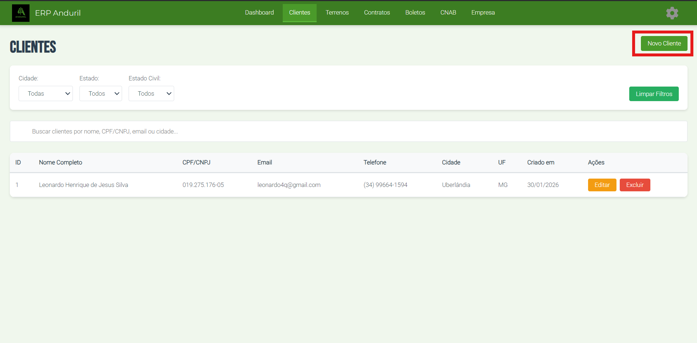

# Como Registrar um Novo Cliente

## Objetivo
Aprender passo-a-passo como cadastrar um novo cliente no ERP Anduril.

## Pré-requisitos
- ✓ Sistema ERP Anduril instalado e aberto
- ✓ Ter dados do cliente disponíveis (nome completo, CPF/CNPJ, telefone, endereço, etc...)

## Localização
**Dashboard → Clientes → Novo Cliente**

## Passo-a-Passo

### **Etapa 1: Acessar a Tela de Novo Cliente**

1. Acesse **"Clientes"** no menu na parte superior
2. Clique em **"Novo Cliente"** (no topo direito)
3. Preencha os dados do cliente
4. Clique em **"Salvar"**

> 

> 

---

### **Etapa 2: Preencher Dados**

Na tela de cadastro, você verá os seguintes campos:

| Campo | Tipo | Obrigatório |
|-------|------|------------|
| **Nome/Razão Social** | Texto | ✅ |
| **CPF/CNPJ** | Número | ✅ |
| **RG** | Texto-Número | ❌ | 
| **Data de Nascimento** | Data | ✅ |
| **Estado Civil** | Caixa de Seleção | ✅ |
| **Nacionalidade** | Texto | ❌ |
| **Naturalidade** | Texto | ❌ |
| **Profissão** | Texto | ❌ |
| **Telefone** | Numéro | ✅ |
| **Email** | Texto | ❌ |

---

### Em Casos de Estado Civil Casado ou União Estável

Na tela de cadastro, você verá os seguintes campos:

| Campo | Tipo | Obrigatório |
|-------|------|------------|
| **Nome do Cônjuge/Companheiro** | Texto | ✅ |
| **CPF do Cônjuge** | Número | ✅ |
| **RG do Cônjuge** | Número-Texto | ❌ |
| **Data de Nascimento do Cônjuge** | Data | ✅ |
| **Profissão do Cônjuge** | Texto | ❌ |
| **Telefone do Cônjuge** | Texto | ✅ |
| **Email do Cônjuge** | Texto | ❌ |
| **Data do Casamento do Cônjuge** | Data | ❌ |
| **Regime de Bens** | Número-Texto | ❌ |
| **Livro** | Número-Texto | ❌ |
| **Dados da Escritura Público de União Estável** | Texto | ❌ |

## Próximos Passos

Após registrar o cliente, você pode criar um contrato associado.

---

**Guia anterior**: [Clientes](./index.md)
