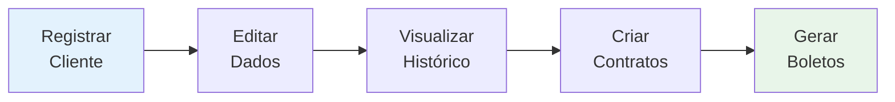
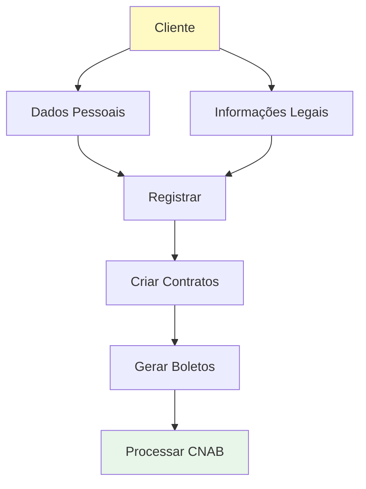
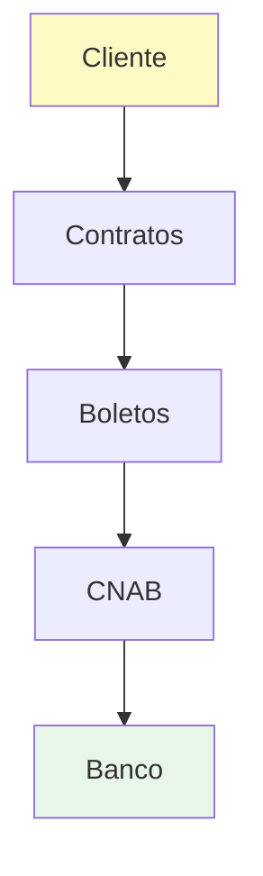

# Clientes

O módulo de **Clientes** permite o cadastro e gerenciamento completo de todos os clientes da sua empresa. Os clientes são a base do sistema, pois são vinculados aos contratos, boletos e todas as operações do ERP.

##  Guias Disponíveis

- [Como Registrar Cliente](./como-registrar-cliente.md) - Passo a passo para cadastrar novo cliente
- [Status dos Clientes](./status-clientes.md) - Estados e validações dos clientes

## Principais Características



- Cadastro de cliente com dados pessoais/empresariais  
- Validação automática de dados  
- Busca rápida por nome ou código  
- Histórico de contratos do cliente  
- Edição e remoção de dados  
- Sincronização com módulos relacionados

> 

## O que você pode fazer



- Registrar novos clientes
- Editar dados de clientes existentes
- Visualizar histórico de clientes
- Aplicar validações de dados
- Vincular a contratos

## Relacionamentos



Os clientes estão conectados a:
- **[Contratos](../contratos/)** - Cada cliente pode ter múltiplos contratos
- **[Boletos](../boletos/)** - Gerados a partir dos contratos
- **[CNAB](../cnab/)** - Processamento automático de cobranças

---

## Exemplo Prático

```
CLIENTE: João Silva
├─ CPF: 123.456.789-00
├─ Email: joao@example.com
├─ Telefone: (11) 98765-4321
├─ Endereço: Rua Principal, 123
│
└─ HISTÓRICO DE CONTRATOS:
   ├─ Contrato #1: CONT-001 (Ativo)
   │  └─ Saldo Devedor: R$ 19.999,98
   ├─ Contrato #2: CONT-002 (Ativo)
   │  └─ Saldo Devedor: R$ 9.999,99
   └─ Contrato #3: CONT-003 (Encerrado)
      └─ Saldo: R$ 0,00 ✅
```

## Explore

1. **Novo cliente?** → [Como Registrar Cliente](./como-registrar-cliente.md)
2. **Dúvida sobre status?** → [Status dos Clientes](./status-clientes.md)
3. **Próximo passo:** [Criar Contratos](../contratos/)

---