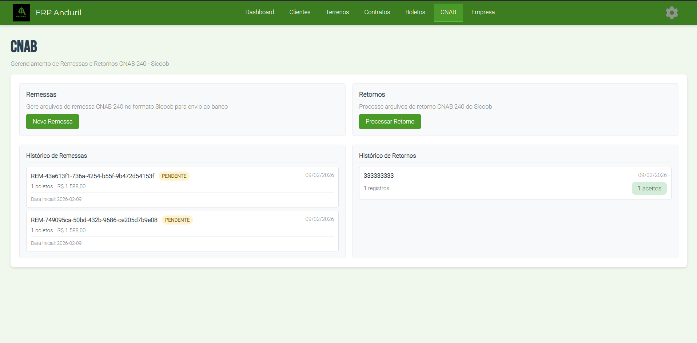

# Como Gerar uma Remessa CNAB

## Objetivo
Aprender como gerar uma remessa CNAB 240 para enviar boletos ao banco.

## Pré-requisitos

- Dados da empresa completos (CNPJ, banco, agência, conta)
- Boletos criados e com status "Aberto"
- Cliente com dados válidos
- Conta bancária ativa

## Localização
**Dashboard → CNAB → Nova Remessa**

## Passo-a-Passo

### **Etapa 1: Acessar Gerar Remessa**

1. Clique em **"CNAB"** no menu superior
2. Clique em **"Nova Remessa"**

> 

### **Etapa 2: Verificar Dados da Empresa**

O sistema exibe os dados que serão usados:

| Campo | Descrição |
|-------|-----------|
| **CNPJ Empresa** | CNPJ que será incluído na remessa |
| **Banco** | Código do banco (ex: 756 = Sicoob) |
| **Agência** | Número da agência bancária |
| **Conta** | Número da conta corrente |

⚠️ **Se algum dado estiver faltando:**
- Clique em **"Configurar Dados da Empresa"**
- Volte a [Empresa → Dados Bancários](../empresa/index.md)
- Preencha e volte

> 

### **Etapa 3: Selecionar Boletos**

1. Sistema mostra lista de boletos com status **"Aberto"**
2. Selecione os boletos que deseja incluir na remessa

**Coluna de Informações:**
- Nome do cliente
- Valor do boleto
- Data de vencimento
- Status

### **Etapa 4: Revisar Resumo**

Antes de gerar, verifique:

```
Resumo da Remessa
├─ Total de Boletos: X
├─ Valor Total: R$ XXX.XXX,XX
├─ Data de Geração: dd/mm/aaaa
└─ Data Base: dd/mm/aaaa
```

> 

### **Etapa 5: Gerar Remessa**

1. Clique em **"Gerar Remessa CNAB"**
2. Sistema processará os dados
3. Arquivo será gerado e baixado automaticamente

> 

### **Etapa 6: Salvar o Arquivo**

O arquivo gerado será: **CBR2026020920.txt**

✅ Salve em local seguro  
✅ Anote o nome do arquivo  
✅ Guarde para consultas futuras  

## O Que Acontece Após Gerar?

1. **Arquivo CNAB criado** - Pronto para enviar ao banco
2. **Boletos mudam para "Pendente"** - Quando confirmado no banco
3. **Remessa é registrada** - Rastreável no sistema
4. **Aguarda retorno** - Banco processará e retornará confirmação

## Validações Importantes

✅ Todos os dados da empresa devem estar preenchidos  
✅ Boletos selecionados devem ter status "Aberto"  
✅ Dados de cliente devem estar completos  
✅ Arquivo será gerado em formato CNAB 240  

## Próximos Passos

Após gerar a remessa:

1. **Enviar ao banco** via internet banking ou pendrive
2. **Aguardar processamento** (geralmente 1 dia útil)
3. **[Importar Retorno CNAB](./como-importar-retorno.md)** para confirmar

**Próximo Guia**: [Como Importar um Retorno CNAB](./como-importar-retorno.md)
