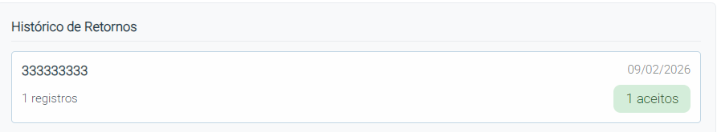
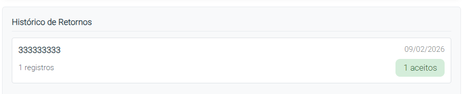

# Como Importar um Retorno CNAB

## Objetivo
Aprender como processar um retorno CNAB do banco para atualizar status de pagamentos.

## Pré-requisitos

- Remessa CNAB já foi enviada ao banco
- Banco processou e retornou arquivo
- Arquivo de retorno disponível (extensão .REM ou .txt)

## Localização
**Dashboard → CNAB → Processar Retorno**

## Passo-a-Passo

### **Acessar Importar Retorno**

1. Clique em **"CNAB"** no menu lateral
2. Clique em **Processar Retorno"**


### **Selecionar Arquivo de Retorno**

1. Clique em **"Escolher Arquivo"** ou **"Procurar"**
2. Localize o arquivo de retorno do banco
3. Selecione o arquivo (extensão .ret ou .txt)

**Formato esperado:**
- Arquivo CNAB 240 retorno do Sicoob
- Contém informações de processamento dos boletos

> 

### **Verificar Dados do Retorno**

Sistema exibe informações sobre o arquivo:

| Informação | Descrição |
|------------|-----------|
| **Data do Retorno** | Quando banco gerou o arquivo |
| **Boletos no Retorno** | Quantos boletos estão no arquivo |
| **Erros Detectados** | Se houver problemas |

> 

### **Revisar Resultado**

Após processar, sistema mostra:
```
Resultado da Importação
├─ Total Processado: X boletos
├─ Pagos: X (✅ Status "aceito")
├─ Rejeitados: X (❌ Verificar motivo)
└─ Erros: X (⚠️ Corrigir e reprocessar)
```

### **Validar e Salvar**

1. Revise os resultados
2. Clique em **"Confirmar"** para finalizar
3. Mensagem de sucesso aparecerá

> 

## O Que Acontece Após Importar?

1. **Boletos atualizados** - Status muda conforme retorno
2. **Datas de pagamento registradas** - Quando banco processou
3. **Movimentação registrada** - Para rastreamento
4. **Relatórios atualizados** - Refletem novos status

## Status Que Podem Resultar

| Status | Significado | Ação |
|--------|------------|------|
| **Pago** | Boleto foi processado com sucesso | Nenhuma |
| **Rejeitado** | Banco recusou boleto | Verificar motivo e refazer |
| **Processando** | Ainda sendo processado | Aguardar próximo retorno |
| **Erro** | Problema na vinculação | Corrigir e reenviar |

## Possíveis Motivos de Rejeição

| Código | Motivo | Solução |
|--------|--------|---------|
| **01** | CPF inválido | Verifique CPF do cliente |
| **02** | Boleto duplicado | Não envie mesmo boleto 2x |
| **03** | Dados inconsistentes | Atualize dados do cliente |
| **08** | Código de rejeição do banco | Contate seu banco |

## Dicas Práticas

**Dica 1: Frequência de Retornos**
- Bancos geram retorno diário
- Importe retornos regularmente
- Facilita rastreamento de pagamentos

**Dica 2: Manter Arquivos**
- Guarde todos os arquivos de retorno
- Importante para auditoria

**Dica 3: Resolver Rejeições Rapidamente**
- Revise boletos rejeitados imediatamente
- Reenvie após correção