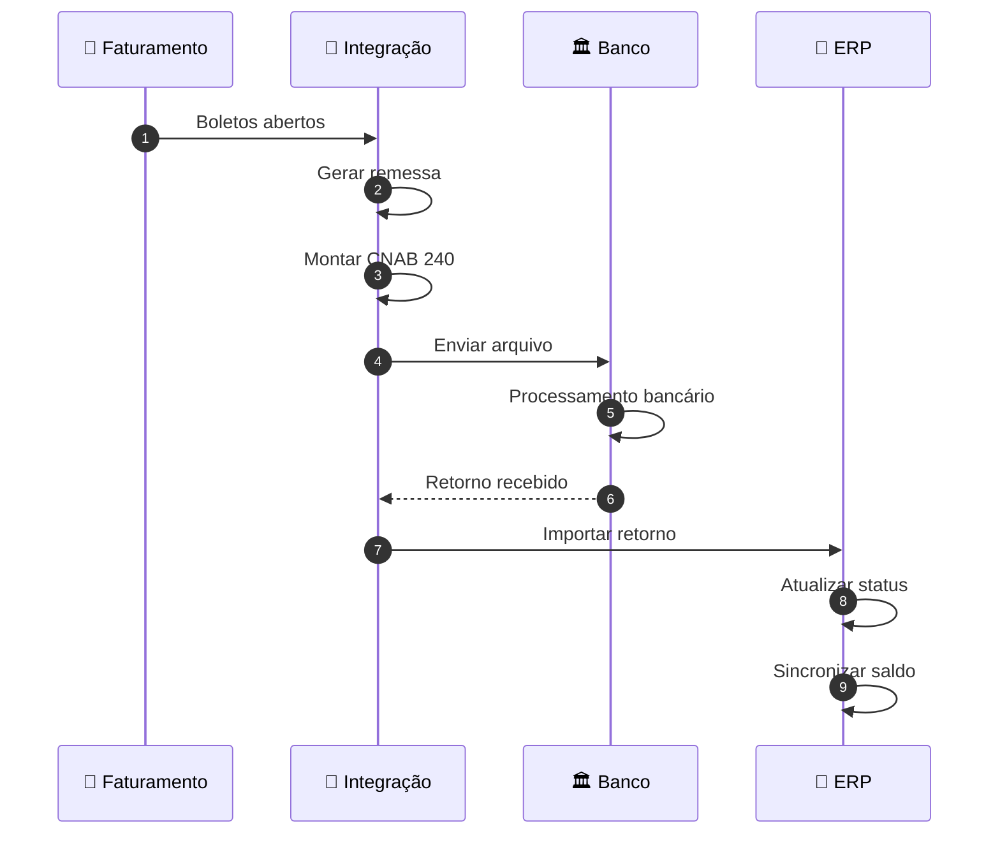

# CNAB

Integração bancária com padrão CNAB 240 para remessas e retornos.

## Guias Disponíveis

- [Como Gerar Remessa](./como-gerar-remessa.md) - Passo a passo para criar remessa CNAB
- [Como Importar Retorno](./como-importar-retorno.md) - Passo a passo para importar retorno bancário
- [Status das Remessas](./status-remessas.md) - Estados e validações

## Principais Características



Funcionalidades principais:
- Gerar remessas CNAB 240
- Importar retornos bancários
- Processar automaticamente status de boletos
- Vincular remessas a retornos
- Diagnosticar problemas de integração
- Sincronizar saldo devedor

## Estados de uma Remessa

| Estado | Descrição | Próximo Estado |
|--------|-----------|---|
| 🟢 **Pendente** | Arquivo criado localmente | Enviada |
| 🟡 **Enviada** | Arquivo enviado ao banco | Processando |
| 🟠 **Erro** | Banco processando remessa porém com erro |
| ✅ **Processada** | Retorno importado, status atualizado | Encerrada |

## Tecnologia

### Padrão CNAB 240
- Layout Sicoob específico
- Encoding Latin-1
- 240 caracteres por linha
- Campos bem definidos

### Processamento
```
Entrada: Arquivo CNAB (.txt)
   ↓
Parse e Validação
   ↓
Atualização de Boletos
   ↓
Recálculo de Saldo Devedor
   ↓
Sincronização Contrato
   ↓
Saída: Banco de Dados Atualizado
```

## Exemplo Prático

### Geração de Remessa

```
1. Selecionar contratos/boletos
2. Validar dados necessários
   ├─ CNPJ Empresa
   ├─ Agência Bancária
   └─ Conta Corrente

3. Gerar arquivo CNAB
   └─ CBR2026011510.REM / CBR2026011508.txt

4. Enviar ao banco
   └─ SICOOB recebe
```

### Importação de Retorno

```
1. Baixar arquivo do banco
   └─ RETORNO_001_2026-02-09.txt

2. Importar no sistema
   ├─ Parse do arquivo
   ├─ Atualizar status boletos
   └─ Recalcular saldo

3. Validar mudanças
   └─ Todos os boletos atualizados? ✅

4. Sincronizar contratos
   └─ Saldo devedor recalculado ✅
```


## Começar Agora

1. **Primeira remessa?** → [Como Gerar Remessa](./como-gerar-remessa.md)
2. **Importar retorno?** → [Como Importar Retorno](./como-importar-retorno.md)
3. **Dúvida sobre status?** → [Status das Remessas](./status-remessas.md)
4. **Análise técnica?** → [Análises Técnicas](./analises/)
