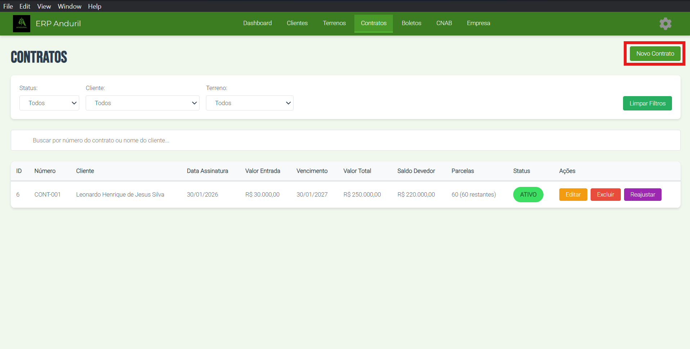
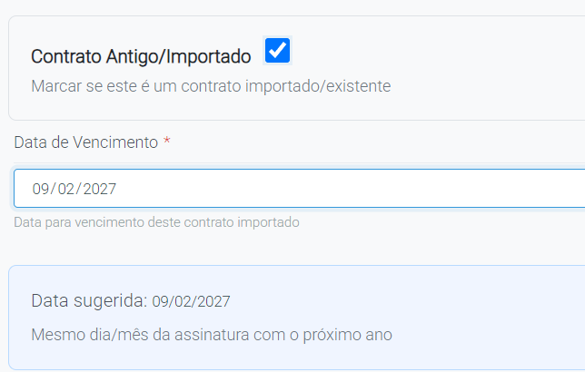

# 📋 Como Gerar Contrato

## Objetivo
Criar um novo contrato vinculado a um cliente.

## Pré-requisitos
- Cliente já cadastrado no sistema
- Dados do contrato disponíveis

## Localização
**Dashboard → Contrato → Novo Contrato**

## Passo-a-Passo

### **Etapa 1: Acessar a Tela de Novo Contrato**

1. Acesse **"Contratos"** no menu
2. Clique em **"Novo Contrato"** (no topo direito)
3. Selecione o cliente
4. Selecione o terreno (valor total é preenchido automaticamente ao selecionar terreno)
5. Preencha os dados do contrato
6. Clique em **"Salvar"**

> 

> 

---

### **Etapa 2: Preencher Dados**

Na tela de cadastro do contrato, você verá os seguintes campos:

| Campo | Tipo | Obrigatório |
|-------|------|------------|
| **Número do Contrato** | Texto-Número | ✅ |
| **Cliente** | Caixa de Seleção | ✅ |
| **Terreno** | Caixa de Seleção | ✅ |
| **Valor Total** | Número Flutuante | ✅ |
| **Valor Entrada** | Número Flutuante | ❌ |
| **Quantidade de Parcelas** | Número | ❌ |
| **Prazo** | Número | ❌ |
| **Taxa** | Número | ❌ |
| **Data de Assinatura** | Data | ❌ |
| **Dia do Vencimento** | Número | ❌ |
| **Primeira Parcela** | Número Flutuante | ❌ |

### **Etapa 3: Preencher Dados**

Apenas marque como **Contrato Especial** para os contratos que não passaram pelo reajuste atual

> 

## Próximos Passos

Após registrar o contrato do cliente, você pode gerar os boletos.

---

**Guia anterior**: [Contratos](./index.md)
