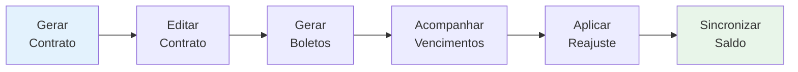
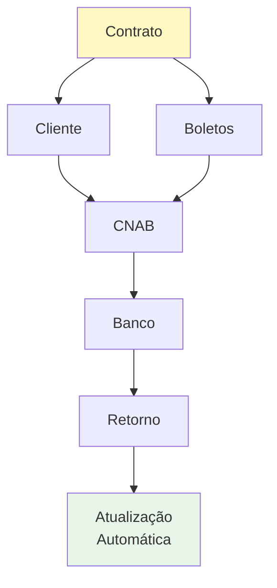

# Contratos

Gestão completa de contratos e sua relação com clientes.

## Guias Disponíveis

- [Como Gerar Contrato](./como-gerar-contrato.md) - Passo a passo para criar novo contrato
- [Status dos Contratos](./status-contratos.md) - Estados e validações dos contratos
- [Datas de Vencimento e Reajuste](./ANALISE_DATAS_VENCIMENTO_REAJUSTE.md) - Análise de datas
- [Sistema de Reajustes](./reajustes/) - Sincronização e reajustes automáticos

## Principais Características

Funcionalidades principais:
- Gerar novos contratos
- Editar contratos existentes
- Acompanhar vencimentos
- Processar reajustes automáticos
- Sincronizar saldo devedor
- Vincular contratos a clientes

## Relacionamentos

## Principais Recursos

### Sistema de Reajustes (🆕)
- Aplicação automática de reajustes anuais
- Sincronização de saldo devedor
- Cálculos determinísticos e auditáveis
- **[Saiba mais sobre reajustes →](./reajustes/README.md)**

##  Explore

1. **Novo contrato?** → [Como Gerar Contrato](./como-gerar-contrato.md)
2. **Precisa reajustar?** → [Sistema de Reajustes](./reajustes/README.md)
3. **Dúvida sobre status?** → [Status dos Contratos](./status-contratos.md)
