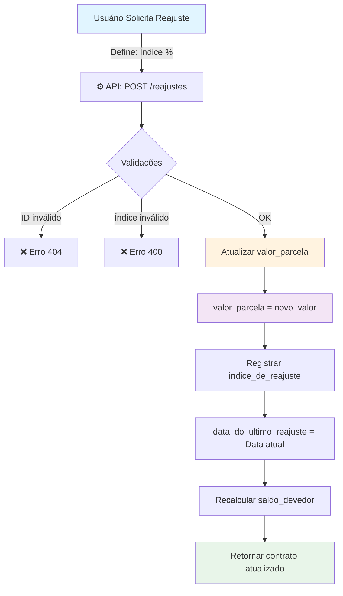
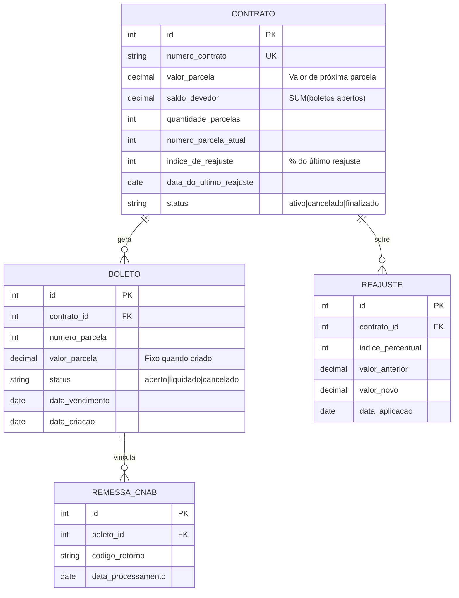
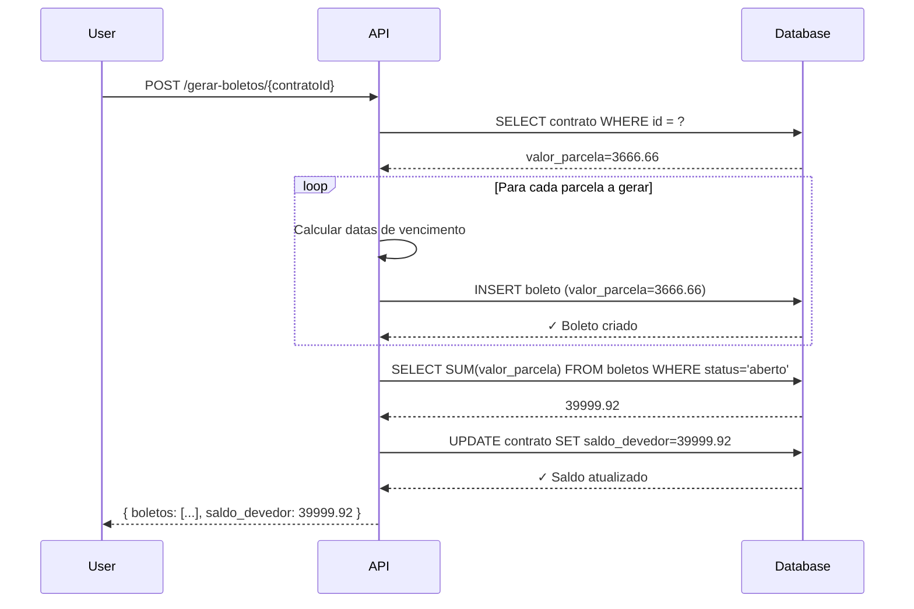

# Arquitetura - Sistema de Reajustes

## Visão Geral

O sistema de reajustes permite que contratos atualizem o valor de parcelas futuras enquanto preserva boletos já gerados. A arquitetura garante consistência entre múltiplas visões dos dados: contrato, boletos e remessas CNAB.

### Diagrama de Fluxo Principal



## Diagrama de Entidades



## Fluxo: Geração de Próximas Parcelas Após Reajuste



## Integração com Outras Features

### A. Geração de Boletos

```
Contrato
├─ valor_parcela: 3.333,33 (Ano 1)
├─ Boletos 1-6: cada um recebe 3.333,33
├───↓ REAJUSTE +10%
├─ valor_parcela: 3.666,66 (Ano 2)
└─ Boletos 7-12: cada um recebe 3.666,66
```

### B. CNAB (Geração de Remessas)

A remessa CNAB usa os valores que estão nos boletos (não são reajustados retroativamente):

```
Remessa incluindo Boletos 1-6:
  Segmento P (boleto 1): 3.333,33
  Segmento P (boleto 2): 3.333,33
  Segmento P (boleto 3): 3.333,33
  Segmento P (boleto 4): 3.333,33
  Segmento P (boleto 5): 3.333,33
  Segmento P (boleto 6): 3.333,33
  ─────────────────────
  Soma: 19.999,98
```

### C. Liquidação de Boletos

```
Boleto liquidado → saldo_devedor é recalculado automaticamente
  Antes: saldo_devedor = 19.999,98 (6 × 3.333,33)
  Liquidar boleto 1
  Depois: saldo_devedor = 16.666,65 (5 × 3.333,33) ✅
```

## Casos de Erro Tratados

| Caso | Validação | Resposta |
|------|-----------|----------|
| Contrato não existe | `contratoId não encontrado` | 404 Not Found |
| Contrato cancelado | `status != 'ativo'` | 403 Forbidden |
| Índice não é número | `isNaN(indice)` | 400 Bad Request |
| Índice < 0 ou > 100 | `indice < 0 OR indice > 100` | 400 Bad Request |
| Novo valor = 0 | `calculado <= 0` | 403 Forbidden |
| Erro no banco | Transaction falha | 500 Internal Server Error |
