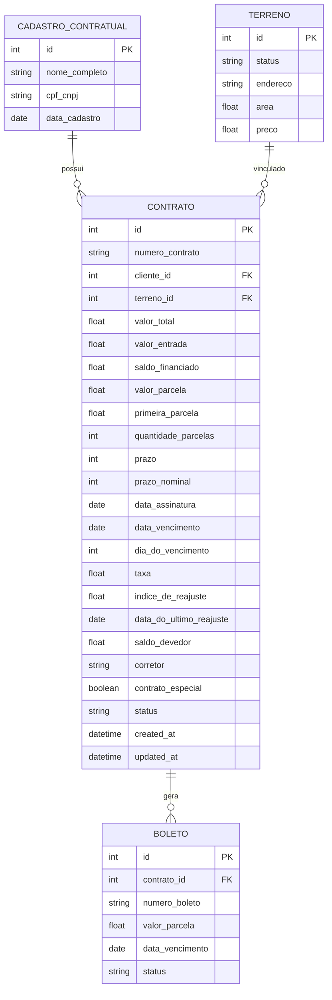
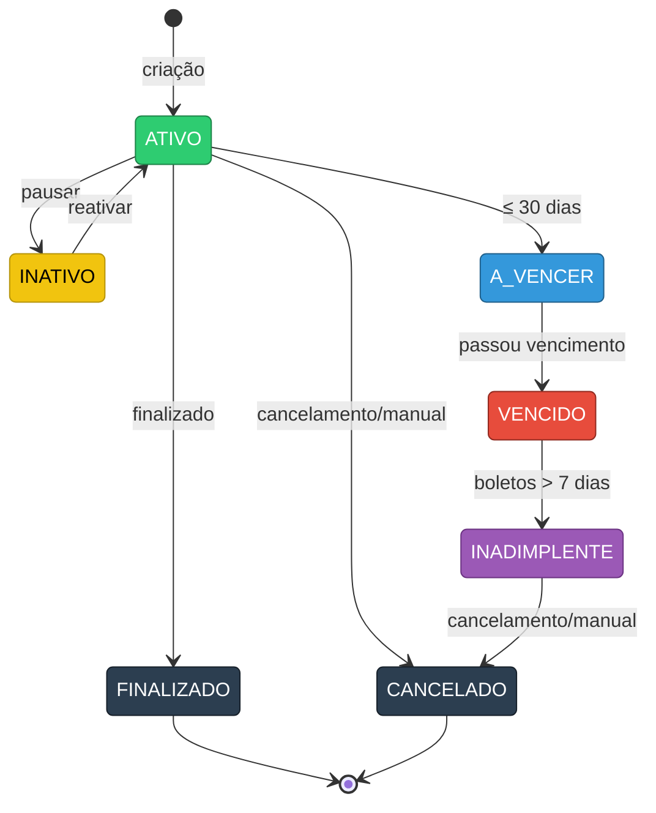
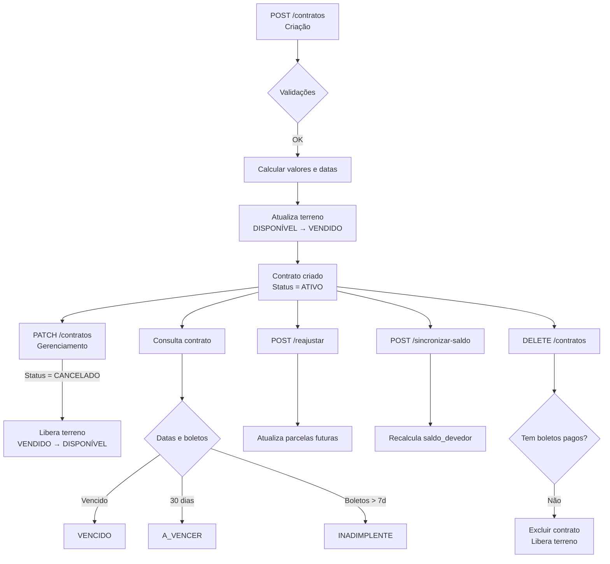

# Status dos Contratos

## Visão Geral

Os contratos possuem diferentes status ao longo do seu ciclo de vida.

## Estados Possíveis

| **Chave** | **Valor** | **Descrição** |
|-------------|----------------|------------------------|
| **ATIVO**       | ativo          | Contrato ativo         |
| **INATIVO**     | inativo        | Contrato inativo       |
| **CANCELADO**   | cancelado      | Contrato cancelado     |
| **FINALIZADO**  | finalizado     | Contrato finalizado    |
| **INADIMPLENTE**| inadimplente   | Contrato inadimplente  |
| **A_VENCER**    | a_vencer       | Contrato a vencer      |
| **VENCIDO**     | vencido        | Contrato vencido       |

## Diagrama de Contratos

### Modelo de Dados — ER Diagram

---

### Fluxo de Estados — State Diagram

---

### Ciclo de Vida do Contrato — Flowchart

**Guia anterior**: [Contratos](./index.md)
