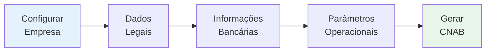
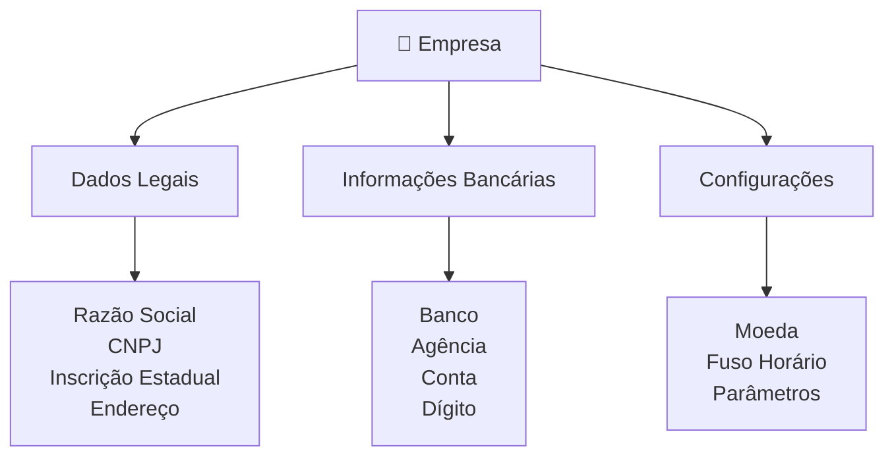
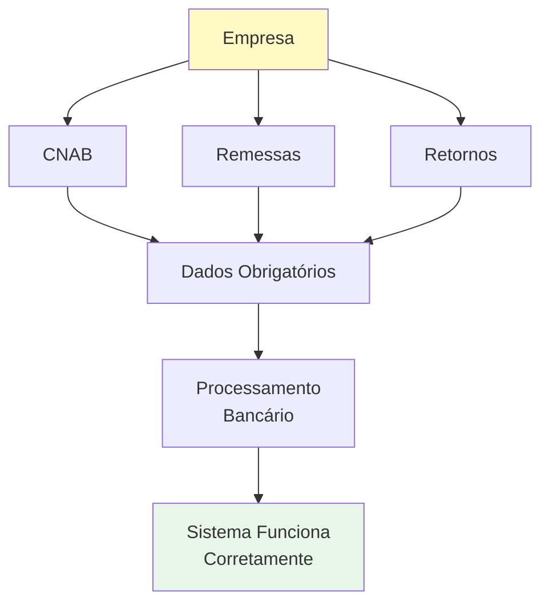

# Empresa

Dados e configuração da empresa para operações bancárias e sistema.

## Principal caractéristicas



- Configurar dados gerais da empresa
- Definir informações bancárias
- Gerenciar CNPJ e dados legais
- Configurar parâmetros operacionais
- Habilitar remessas CNAB

## Importante

As configurações de empresa são **essenciais** para:
- Gerar remessas CNAB corretas
- Processar operações bancárias
- Gerar relatórios legais
- Cumprir regulamentações

## Campos Principais



### Dados Legais
- Razão Social
- CNPJ (validado)
- Inscrição Estadual
- Inscrição Municipal
- Endereço completo
- Email da empresa
- Telefone da empresa

### Informações Bancárias
- Banco (SICOOB - 756)
- Agência (número de agência)
- Conta Corrente
- Dígito da Conta
- Nome do Banco (SICOOB)
- Código da Agência para CNAB

## Dependências do Sistema



**Sem configuração de empresa:**
- ❌ Não pode gerar remessas CNAB
- ❌ Não pode importar retornos
- ❌ Processamento bancário bloqueado

**Com configuração completa:**
- ✅ Sistema funciona normalmente
- ✅ Remessas geradas corretamente
- ✅ Retornos processados automaticamente

## Exemplo de Configuração

```
EMPRESA: Anduril Imóveis Ltda.
├─ CNPJ: 12.345.678/0001-90
├─ Inscrição Estadual: 123.456.789.012
├─ Endereço: Av. Principal, 1000
│  Complemento: Sala 100
│  São Paulo, SP - CEP 01310-100
│
├─ INFORMAÇÕES BANCÁRIAS:
│  ├─ Banco: SICOOB (756)
│  ├─ Agência: 0001
│  ├─ Conta: 123456-7
│  ├─ Dígito: 8
│  └─ Nome: Banco SICOOB
│
└─ STATUS: ✅ Configurado
   Pronto para gerar CNAB
```

---

## Explore

Após configurar a empresa:

1. **Gerar remessas:** [Como Gerar Remessa CNAB](../cnab/guias/como-gerar-remessa.md)
2. **Importar retornos:** [Como Importar Retorno](../cnab/guias/como-importar-retorno.md)
3. **Criar clientes:** [Como Registrar Cliente](../clientes/como-registrar-cliente.md)
4. **Criar contratos:** [Como Gerar Contrato](../contratos/como-gerar-contrato.md)