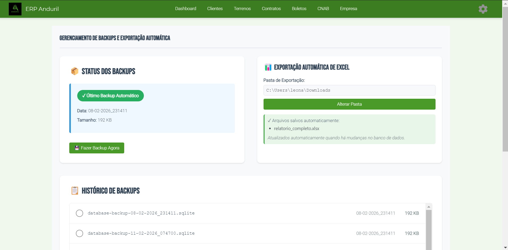

# Como Gerar Exportação

## Objetivo
Configurar pasta para exportação do arquivo em Excel 


## Pré-requisitos
- Existir massa de dados para que os relatório gerem por completo

## Localização
**Dashboard → Configurações**

## Passo-a-Passo

### Selecionar Tipo

1. Acessar "Painel Administração" no menu → Exportação Automática de Excel
2. Clicar: Pasta de Exportação
3. Configurar uma pasta dentro do sistema
2. Clicar: "Alterar pasta"

> 

## Formatos Suportados

| Formato | Status | Descrição |
|---------|--------|-----------|
| 📄 Excel (.xlsx) | ✅ Disponível | Padrão - Excel 2007+ |
| 📋 CSV | ⏳ Em breve | Para importação em outros sistemas |
| 📑 PDF | ⏳ Em breve | Para impressão e compartilhamento |
| 📊 Google Sheets | ⏳ Em breve | Compartilhamento online |

---

## Formatos Excel

### Estrutura de Arquivo

```
Arquivo: relatorio_completo.xlsx
├─ Planilha 1: Dados
│  └─ Linhas: cliente_id, nome, cpf, email, telefone, ...
├─ Planilha 2: Filtros (opcional)
│  └─ Pré-configurados para análise rápida
└─ Planilha 3: Metadados
   └─ Data export, quantidade registros, status
```

### Coloring & Formatação

```
Cabeçalhos: Fundo azul, texto branco
Linhas pares: Fundo cinza claro
Totais: Fundo amarelo, bold
Status: Código de cores (🟢 Ativo, 🔴 Inativo)
```
---

**Guia anterior**: [Exportação](./index.md)