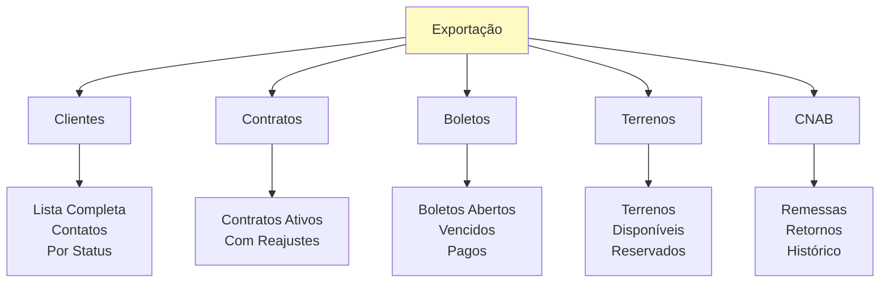

# Exportação

Geração de relatórios e exportação de dados em Excel.

## Guias Disponíveis
 
- [Como Gerar Exportação](./como-gerar-exportacao.md) - Como gerar relatório para exportação no Excel

## Principal caractéristicas

Funcionalidades principais:
- Gerar relatórios em Excel
- Exportar dados de contratos
- Exportar dados de clientes
- Exportar dados de boletos
- Exportar dados de terrenos
- Configurar pasta de destino
- Agendamento de exportações

## Tipos de Relatórios

### Por Módulo

## Privacidade de Dados

- Apenas dados autorizados são exportados
- Masks para CPF/CNPJ (opcional)
- Sem senhas ou dados confidenciais
- Logs de exportação registrados
- Conformidade com LGPD