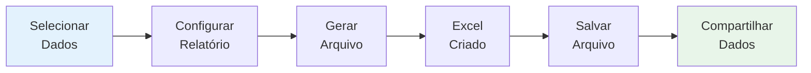
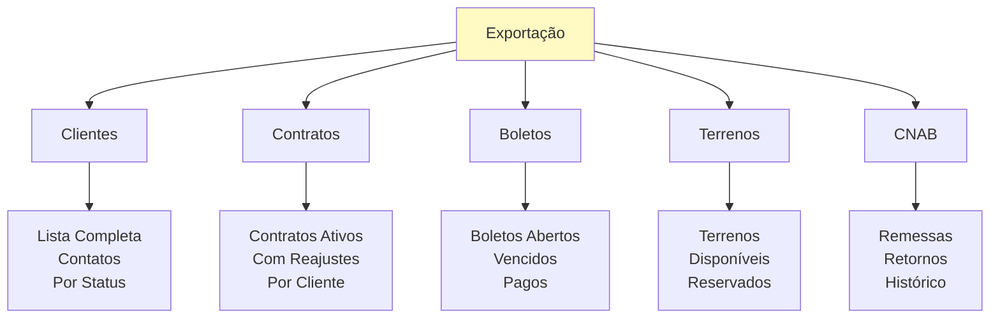
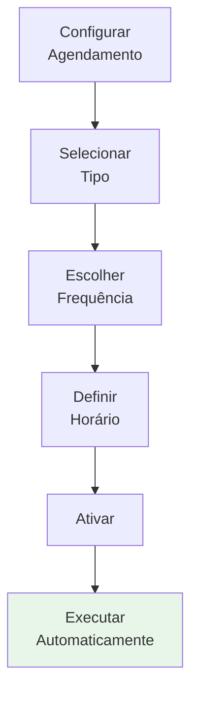

# 📊 Exportação

Geração de relatórios e exportação de dados em Excel.

---

## 📖 Guias Disponíveis

- Como gerar relatórios (em breve)
- Configuração de pasta de exportação (em breve)
- Arquivos gerados automaticamente (em breve)

---

## 🎯 O que você pode fazer



Funcionalidades principais:
- ✅ Gerar relatórios em Excel
- ✅ Exportar dados de contratos
- ✅ Exportar dados de clientes
- ✅ Exportar dados de boletos
- ✅ Exportar dados de terrenos
- ✅ Configurar pasta de destino
- ✅ Agendamento de exportações

---

## 📋 Tipos de Relatórios

### Por Módulo



---

## 📊 Formatos Suportados

| Formato | Status | Descrição |
|---------|--------|-----------|
| 📄 Excel (.xlsx) | ✅ Disponível | Padrão - Excel 2007+ |
| 📋 CSV | ⏳ Em breve | Para importação em outros sistemas |
| 📑 PDF | ⏳ Em breve | Para impressão e compartilhamento |
| 📊 Google Sheets | ⏳ Em breve | Compartilhamento online |

---

## 💾 Formatos Excel

### Estrutura de Arquivo

```
Arquivo: Exportacao_clientes_2026-02-09.xlsx
├─ Planilha 1: Dados
│  └─ Linhas: cliente_id, nome, cpf, email, telefone, ...
├─ Planilha 2: Filtros (opcional)
│  └─ Pré-configurados para análise rápida
└─ Planilha 3: Metadados
   └─ Data export, quantidade registros, status
```

### Coloring & Formatação

```
Cabeçalhos: Fundo azul, texto branco
Linhas pares: Fundo cinza claro
Totais: Fundo amarelo, bold
Status: Código de cores (🟢 Ativo, 🔴 Inativo)
```

---

## 📤 Locais de Salvamento

### Configuração Padrão

```
C:/Users/[Username]/Documents/Anduril/Exportacoes/
│
├─ Clientes/
│  ├─ clientes_2026-02-09.xlsx
│  ├─ clientes_2026-02-08.xlsx
│  └─ ...
│
├─ Contratos/
│  ├─ contratos_2026-02-09.xlsx
│  └─ ...
│
├─ Boletos/
│  ├─ boletos_2026-02-09.xlsx
│  └─ ...
│
└─ Terrenos/
   ├─ terrenos_2026-02-09.xlsx
   └─ ...
```

---

## 🔄 Exportações Automáticas

### Agendamento



**Frequências disponíveis:**
- Diária (01:00 AM)
- Semanal (segundas 09:00 AM)
- Mensal (1º do mês 08:00 AM)

---

## 💡 Exemplos de Uso

### Relatório de Clientes

```
Arquivo: Clientes_2026-02-09.xlsx

Dados Inclusos:
├─ ID do Cliente
├─ Nome Completo
├─ CPF/CNPJ
├─ Email
├─ Telefone
├─ Endereço Completo
├─ Data de Cadastro
├─ Contratos Ativos
└─ Saldo Total Devedor

Filtros:
├─ Por Status
├─ Por Data de Cadastro
└─ Por Saldo
```

### Relatório de Contratos

```
Arquivo: Contratos_2026-02-09.xlsx

Dados Inclusos:
├─ Número do Contrato
├─ Cliente
├─ Valor da Parcela
├─ Saldo Devedor
├─ Data Última Reajuste
├─ Próximo Reajuste
├─ Status
└─ Data de Criação

Análises:
├─ Contratos com reajuste pendente
├─ Saldo total (gráfico)
└─ Por cliente
```

---

## 🚀 Como Usar

### Passo 1: Selecionar Tipo
```
1. Ir em: Sistema → Exportação
2. Clicar: "Novo Relatório"
3. Selecionar: Tipo de dados (Clientes, Contratos, etc)
```

### Passo 2: Configurar
```
4. Escolher: Período (data início/fim)
5. Filtrar: Status, cliente, contrato (opcional)
6. Revisar: Quantidade de registros
```

### Passo 3: Gerar
```
7. Clicar: "Gerar Relatório"
8. Aguardar: Processamento
9. Salvar: Arquivo Excel
```

---

## 📌 Checklist Rápido

Antes de exportar:
- [ ] Dados foram verificados no sistema
- [ ] Período/filtros estão corretos
- [ ] Pasta destino tem espaço livre
- [ ] Arquivo não será sobrescrito
- [ ] Compartilhamento autorizado

---

## 🔒 Privacidade de Dados

- ✅ Apenas dados autorizados são exportados
- ✅ Masks para CPF/CNPJ (opcional)
- ✅ Sem senhas ou dados confidenciais
- ✅ Logs de exportação registrados
- ✅ Conformidade com LGPD

---

## 🎯 Próximos Passos

- Gerar primeiro relatório
- Configurar agendamento
- Compartilhar com gerência
- Analisar dados
