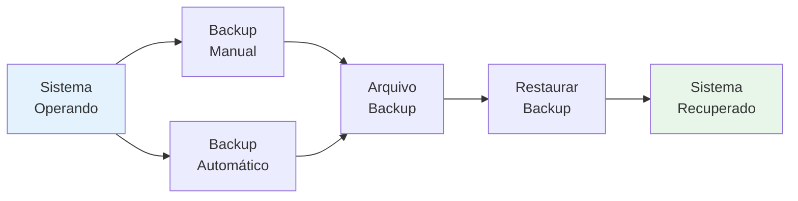
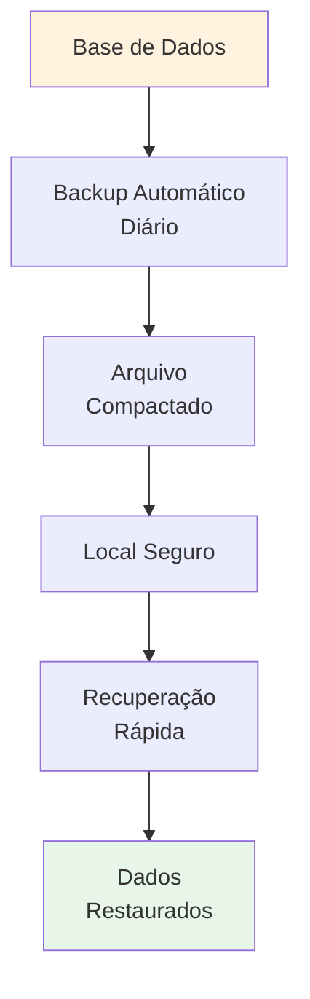
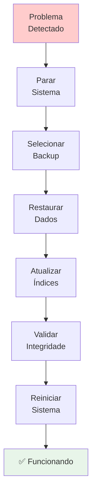

# ⚙️ Sistema

Funcionalidades gerais de sistema, backup e gerenciamento de banco de dados.

---

## 📖 Guias Disponíveis

- Sistema de backup automático (em breve)
- Gerenciamento de banco de dados (em breve)
- Restauração de backups (em breve)
- Visualização de informações do sistema (em breve)

---

## 🎯 O que você pode fazer



- ✅ Realizar backups manuais
- ✅ Restaurar backups anteriores
- ✅ Gerenciar banco de dados
- ✅ Visualizar logs do sistema
- ✅ Monitorar performance
- ✅ Acompanhar versões do sistema

---

## 🔐 Backup & Recuperação

O sistema oferece:



- ✅ Backup automático diário
- ✅ Backup manual sob demanda
- ✅ Restauração rápida
- ✅ Histórico de versões (últimos 30 dias)
- ✅ Segurança de dados com criptografia
- ✅ Verificação de integridade

---

## 📊 Tipos de Backup

| Tipo | Frequência | Retenção |
|------|-----------|----------|
| 🟢 Automático | Diário (01:00 AM) | 30 dias |
| 🟡 Manual | Sob demanda | Permanente |
| 🟠 Incremental | Horário | 7 dias |
| 🔵 Completo | Semanal | 90 dias |

---

## 🚀 Recuperação de Desastres



Plano de recuperação:
1. **Identificar problema**
2. **Parar sistema**
3. **Selecionar backup anterior**
4. **Restaurar dados**
5. **Validar integridade**
6. **Reiniciar sistema**

---

## 📋 Monitoramento do Sistema

### Informações Disponíveis

```
├─ Versão do Sistema
├─ Data da Última Atualização
├─ Espaço em Disco
│  ├─ Total
│  ├─ Utilizado
│  └─ Disponível
├─ Banco De Dados
│  ├─ Tamanho Total
│  ├─ Número de Registros
│  └─ Último Backup
└─ Performance
   ├─ CPU
   ├─ Memória
   └─ Conexões Ativas
```

---

## 💡 Cenários de Uso

### Backup Manual

Quando fazer:
- Antes de grandes operações
- Antes de atualizações
- Antes de mudanças críticas
- Periodicamente

```
1. Acessar: Sistema → Backup
2. Clicar: "Fazer Backup Agora"
3. Aguardar conclusão
4. Verificar arquivo gerado
```

### Restauração

Quando restaurar:
- Após erro crítico
- Após perda de dados
- Após corrupção

```
1. Parar o sistema
2. Acessar: Sistema → Restaurar
3. Selecionar arquivo backup
4. Confirmar restauração
5. Reiniciar sistema
```

---

## 🔒 Segurança de Dados

- ✅ Criptografia de arquivos
- ✅ Verificação de integridade
- ✅ Logs de acesso
- ✅ Permissões de acesso
- ✅ Auditoria de operações

---

## 📌 Checklist Regular

Faça mensalmente:
- [ ] Teste de restauração de backup
- [ ] Verificar espaço em disco
- [ ] Revisar logs do sistema
- [ ] Confirmar backups automáticos
- [ ] Atualizar documentação

---

## 🚀 Próximos Passos

- Configurar alertas de sistema
- Monitorar performance
- Otimizar banco de dados
- Revisar logs regularmente
