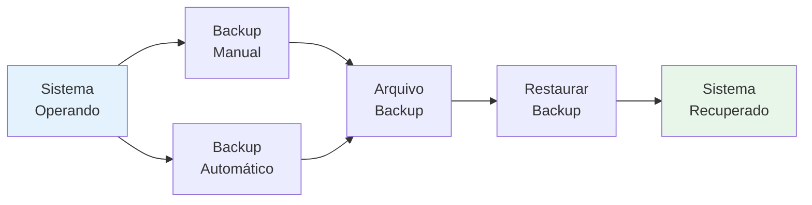

# Sistema

Funcionalidades gerais de sistema, backup e gerenciamento de banco de dados.

## Guias Disponíveis

- [Sistema de Backup](sistema-de-backup.md) - Instruções do sistema de backup automático

## Principal caractéristicas



- Realizar backups manuais
- Restaurar backups anteriores
- Gerenciar banco de dados
- Visualizar logs do sistema
- Monitorar performance
- Acompanhar versões do sistema

## Tipos de Backup

| Tipo | Frequência | Retenção |
|------|-----------|----------|
| 🟢 Automático | Diário | De 2 em 2 horas |
| 🟡 Manual | Sob demanda | Permanente |

## Cenários de Uso

### Backup Manual

Quando fazer:
- Antes de grandes operações
- Antes de atualizações
- Antes de mudanças críticas
- Periodicamente

```
1. Acessar: Sistema → Backup
2. Clicar: "Fazer Backup Agora"
3. Aguardar conclusão
4. Verificar arquivo gerado
```

### Restauração

Quando restaurar:
- Após erro crítico
- Após perda de dados
- Após corrupção

```
1. Parar o sistema
2. Acessar: Sistema → Restaurar
3. Selecionar arquivo backup
4. Confirmar restauração
5. Reiniciar sistema
```

## Privacidade de Dados

- Criptografia de arquivos
- Verificação de integridade
- Logs de acesso
- Permissões de acesso
- Auditoria de operações