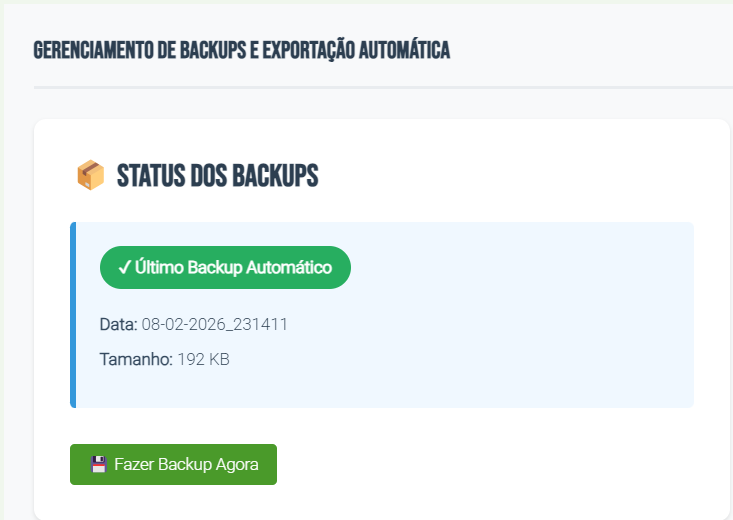
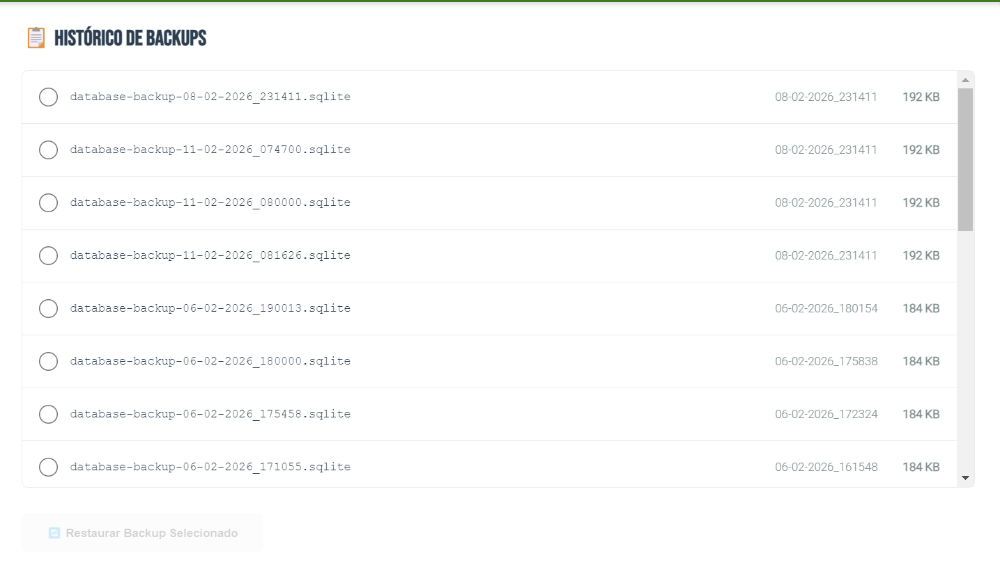
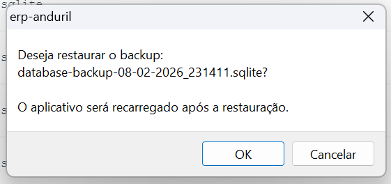

# Sistema de Backup

## Objetivo
Configurar sistema de backup e fazer da utilização do mesmo

## Pré-requisitos
- Ter o sistema ERP funcionando

## Localização
**Dashboard → Configurações**

## Passo-a-Passo

### Acessar a Tela de Backup

1. Acessar "Painel Administrção" no menu

> 

2. Clicar: Fazer Backup Agora

> 

3. Após notificação o backup está feito

---

### Como Restaurar Backup Feito

1. Acessar "Painel Administrção" no menu
2. Navegar até o "Histórico de Backup"

> 

3. Selecionar Backup
4. Clicar: Restaurar Backup Selecionado
5. Confirmar restauração

> 

6. Aguarde resete do sistema e o backup será feito

> 

---

**Guia anterior**: [Sistema](./index.md)