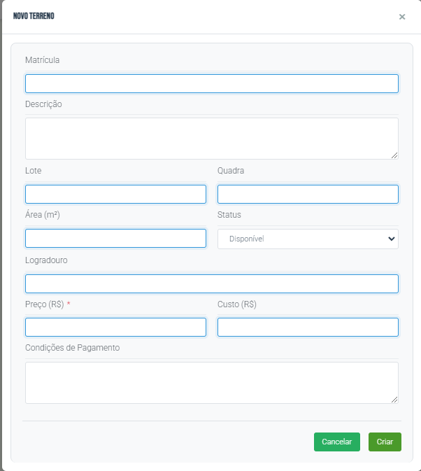

# Como Registrar Terreno

## Objetivo
Aprender a cadastrar um novo terreno no sistema.

## Pré-requisitos
- Dados do terreno disponíveis

## Localização

**Dashboard → Terrenos → Novo Terreno**

## Passo-a-Passo

1. Acesse **Terrenos** no menu
2. Clique em **"Novo Terreno"**
3. Preencha os dados do terreno
4. Clique em **"Criar"**

> 

> 

**Guia anterior**: [Terrenos](./index.md)
