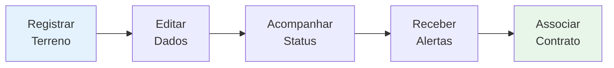
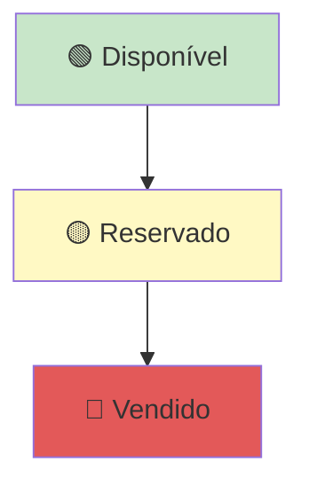
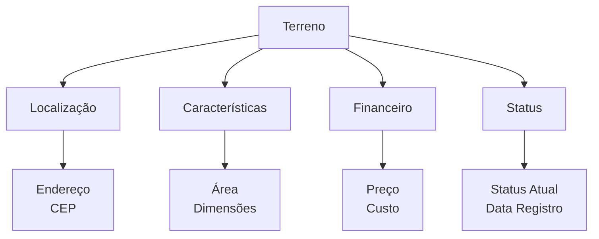

# Terrenos

Cadastro, gerenciamento e monitoramento de terrenos disponíveis.

## Guias Disponíveis

- [Como Registrar Terreno](./como-registrar-terreno.md) - Passo a passo para cadastrar novo terreno
- [Status dos Terrenos](./status-terrenos.md) - Estados e validações dos terrenos

## Principais Características

- Registrar novos terrenos
- Editar dados de terrenos
- Acompanhar status e reservas
- Receber alertas de terrenos
- Validar dados cadastrados
- Associar a contratos
- Rastrear custo (novo)

## 📊 Estados de um Terreno

| Estado | Descrição | Próximo Estado |
|--------|-----------|---|
| 🟢 **Disponível** | Terreno livre para venda | Reservado ou Vendido |
| 🟡 **Reservado** | Terreno com cliente interessado | Disponível ou Vendido |
| 🔴 **Vendido** | Venda concluída, contrato ativo |

## Campos Principais

## Explore

1. **Novo terreno?** → [Como Registrar Terreno](./como-registrar-terreno.md)
2. **Dúvida sobre status?** → [Status dos Terrenos](./status-terrenos.md)
3. **Próximo passo:** [Criar Contrato](../contratos/)
