# Terrenos

Cadastro, gerenciamento e monitoramento de terrenos disponíveis.

## Guias Disponíveis

- [Como Registrar Terreno](./como-registrar-terreno.md) - Passo a passo para cadastrar novo terreno
- [Status dos Terrenos](./status-terrenos.md) - Estados e validações dos terrenos

## Principais Características

- Registrar novos terrenos
- Editar dados de terrenos
- Acompanhar status e reservas
- Receber alertas de terrenos
- Validar dados cadastrados
- Associar a contratos
- Rastrear custo (novo)

## 📊 Estados de um Terreno

```mermaid
graph TD
    A["🟢 Disponível"] --> B["🟡 Reservado"]
    B --> C["🔴 Vendido"]
    
    style A fill:#c8e6c9
    style B fill:#fff9c4
    style C fill:#e35959
```

| Estado | Descrição | Próximo Estado |
|--------|-----------|---|
| 🟢 **Disponível** | Terreno livre para venda | Reservado ou Vendido |
| 🟡 **Reservado** | Terreno com cliente interessado | Disponível ou Vendido |
| 🔴 **Vendido** | Venda concluída, contrato ativo |

## Campos Principais

```mermaid
graph TD
    A["Terreno"] --> B["Localização"]
    A --> C["Características"]
    A --> D["Financeiro"]
    A --> E["Status"]
    
    B --> B1["Endereço<br/>CEP"]
    C --> C1["Área<br/>Dimensões"]
    D --> D1["Preço<br/>Custo"]
    E --> E1["Status Atual<br/>Data Registro"]
```

## Explore

1. **Novo terreno?** → [Como Registrar Terreno](./como-registrar-terreno.md)
2. **Dúvida sobre status?** → [Status dos Terrenos](./status-terrenos.md)
3. **Próximo passo:** [Criar Contrato](../contratos/)
