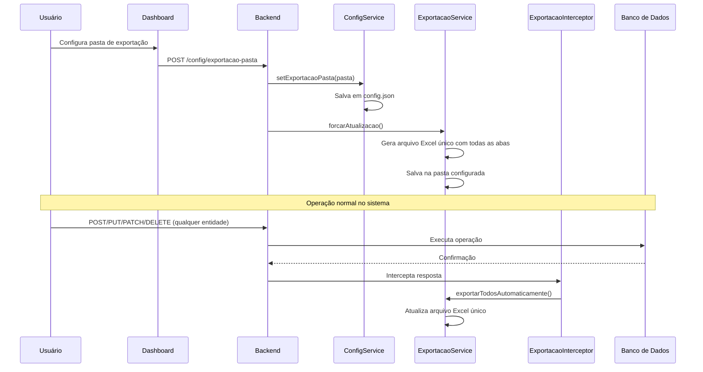

# 📊 Exportação Automática de Excel

## Visão Geral

O sistema implementa exportação automática de arquivos Excel que são salvos em uma pasta configurável e atualizados automaticamente sempre que há mudanças no banco de dados.

---

## 🎯 Funcionalidades

### 1. Configuração de Pasta

- **Localização**: Dashboard → Seção "Exportação Automática de Excel"
- **Como configurar**:
  1. Clique em "Escolher Pasta"
  2. Selecione a pasta onde os arquivos Excel devem ser salvos
  3. Os arquivos serão salvos automaticamente após a configuração

### 2. Arquivo Gerado

Um único arquivo Excel é gerado automaticamente na pasta configurada:

- `relatorio_YYYY-MM-DD.xlsx` - Relatório completo com todas as abas:
  - **Clientes**: Lista completa de clientes cadastrados
  - **Terrenos**: Lista completa de terrenos disponíveis
  - **Contratos**: Lista completa de contratos
  - **Boletos**: Lista completa de boletos
  - **Remessas CNAB**: Histórico de remessas CNAB geradas
  - **Retornos CNAB**: Histórico de retornos CNAB processados

**Nota**: A data no nome do arquivo é atualizada diariamente (formato: YYYY-MM-DD)

### 3. Atualização Automática

Os arquivos são atualizados automaticamente quando:

- **Mudanças no banco de dados**: Qualquer operação POST, PUT, PATCH ou DELETE
- **Inicialização do backend**: Se a pasta estiver configurada, arquivos são gerados na inicialização
- **Configuração de pasta**: Atualização imediata ao configurar a pasta pela primeira vez

### 4. Otimizações

- **Limite de frequência**: Máximo 1 atualização por segundo (evita sobrecarga)
- **Atualização inteligente**: Apenas atualiza se arquivo não existe ou foi modificado externamente
- **Processamento assíncrono**: Não bloqueia a resposta das requisições HTTP

---

## 🔧 Arquitetura Técnica

### Backend

#### ConfigService (`backend/src/config/config.service.ts`)
- Gerencia configuração da pasta de exportação
- Armazena em `config.json` (AppData/Roaming/erp-anduril/config.json em produção)
- Validação de pasta existente e diretório válido

#### ExportacaoService (`backend/src/exportacao/exportacao.service.ts`)
- Métodos de exportação automática:
  - `exportarTodosAutomaticamente()`: Exporta um único arquivo Excel com todas as abas
  - `exportarRelatorioCompleto()`: Gera relatório completo com todas as tabelas
  - `salvarArquivoExcel()`: Salva arquivo na pasta configurada
  - `precisaAtualizar()`: Verifica se precisa atualizar
  - `forcarAtualizacao()`: Força atualização imediata

#### ExportacaoInterceptor (`backend/src/exportacao/exportacao.interceptor.ts`)
- Interceptor global que monitora mudanças no banco
- Atualiza arquivos automaticamente após POST, PUT, PATCH, DELETE
- Ignora rotas que não modificam dados relevantes

#### Endpoints

- `GET /config/exportacao-pasta`: Obtém pasta configurada
- `POST /config/exportacao-pasta`: Configura pasta de exportação
  ```json
  {
    "pasta": "C:\\Users\\Usuario\\Documents\\Exportacoes"
  }
  ```
- `POST /exportacao/forcar-atualizacao`: Força atualização imediata

### Frontend

#### Dashboard (`frontend/src/pages/Dashboard/Dashboard.tsx`)
- Interface para configurar pasta de exportação
- Exibe pasta atual configurada
- Lista arquivos que serão salvos automaticamente
- Força atualização imediata ao configurar pasta

#### Electron Integration
- `electronDialogService.showOpenDirectoryDialog()`: Dialog nativo para escolher pasta
- Integrado com o serviço de configuração do backend

---

## 📝 Fluxo de Funcionamento



---

## ⚙️ Configuração

### Localização do Arquivo de Configuração

- **Produção**: `%APPDATA%\erp-anduril\config.json`
- **Desenvolvimento**: `{projeto}/config.json`

### Estrutura do config.json

```json
{
  "exportacaoPasta": "C:\\Users\\Usuario\\Documents\\Exportacoes"
}
```

---

## 🐛 Troubleshooting

### Arquivos não estão sendo gerados

1. **Verificar se pasta está configurada**:
   - Acesse o Dashboard
   - Verifique se há uma pasta configurada na seção "Exportação Automática de Excel"

2. **Verificar permissões**:
   - Certifique-se de que o backend tem permissão de escrita na pasta configurada

3. **Verificar logs**:
   - Consulte os logs do backend para erros relacionados à exportação

### Arquivos não estão sendo atualizados

1. **Verificar interceptor**:
   - O interceptor está registrado globalmente em `main.ts`
   - Verifique se não há erros nos logs

2. **Forçar atualização**:
   - Use o endpoint `POST /exportacao/forcar-atualizacao` para forçar atualização imediata

### Pasta não pode ser configurada

1. **Verificar se pasta existe**:
   - A pasta deve existir antes de ser configurada
   - O sistema não cria a pasta automaticamente (apenas valida)

2. **Verificar se é um diretório**:
   - O caminho deve apontar para um diretório, não um arquivo

---

## 📊 Benefícios

- ✅ **Automático**: Não precisa exportar manualmente
- ✅ **Atualizado**: Arquivo sempre reflete o estado atual do banco
- ✅ **Centralizado**: Um único arquivo Excel com todas as informações
- ✅ **Completo**: Inclui todas as tabelas (Clientes, Terrenos, Contratos, Boletos, Remessas CNAB, Retornos CNAB)
- ✅ **Eficiente**: Atualiza apenas quando necessário
- ✅ **Não bloqueante**: Não afeta performance das requisições

---

## 🔄 Mudanças em Relação à Versão Anterior

### Removido
- Botões "Exportar Excel" das páginas (Boletos, Terrenos, Clientes, Contratos)
- Função `handleExportCompleto` do Dashboard
- Exportação de arquivos separados (agora é um único arquivo)

### Adicionado
- Sistema de exportação automática
- Configuração de pasta via Dashboard
- Interceptor para monitorar mudanças
- Atualização automática na inicialização
- Exportação de um único arquivo Excel com todas as abas
- Inclusão de Remessas CNAB e Retornos CNAB no relatório completo

---

**Última atualização**: Janeiro 2025  
**Versão**: 1.0
